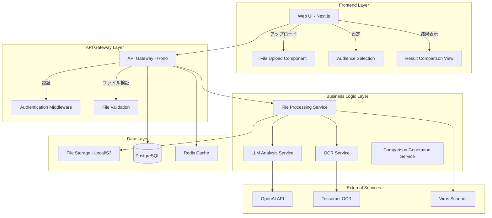

# プレゼン資料改善AI アーキテクチャ設計

## システム概要

プレゼン資料改善AIは、ユーザーがアップロードしたスライド資料（画像、PDF、テキスト）をLLMで解析し、聞き手属性に応じた改善提案を提供するWebアプリケーションです。

## アーキテクチャパターン

- **パターン**: レイヤードアーキテクチャ + マイクロサービス的分離
- **理由**: 
  - ファイル処理、OCR、LLM解析などの処理を独立して管理可能
  - 将来的なスケーラビリティを考慮
  - 異なる処理時間（OCR、LLM API呼び出し）に対応

## システム構成図

## コンポーネント構成

### フロントエンド
- **フレームワーク**: Next.js 14 (App Router)
- **UI コンポーネント**: Radix UI + Tailwind CSS
- **状態管理**: React Query + Zustand
- **ファイルアップロード**: React Dropzone
- **プログレス表示**: Real-time progress via WebSocket/SSE

### バックエンド
- **フレームワーク**: Hono (TypeScript)
- **認証方式**: JWT + セッション管理
- **ファイル処理**: Multer + Sharp (画像処理)
- **OCR**: Tesseract.js / Google Vision API
- **LLM統合**: OpenAI API / Anthropic Claude
- **非同期処理**: Bull Queue (Redis)

### データベース
- **DBMS**: PostgreSQL
- **ORM**: Prisma
- **キャッシュ**: Redis
- **ファイルストレージ**: ローカルファイルシステム (開発) / AWS S3 (本番)

### インフラストラクチャ
- **コンテナ化**: Docker + Docker Compose
- **プロキシ**: Nginx (本番環境)
- **監視**: ヘルスチェックエンドポイント
- **ログ**: 構造化ログ (JSON形式)

## セキュリティ設計

### ファイルセキュリティ
- ファイル形式検証（MIME Type + 拡張子）
- ファイルサイズ制限（10MB）
- ウイルススキャン（ClamAV統合）
- 機密情報検出（正規表現ベース）

### データ保護
- SSL/TLS暗号化通信
- ファイル自動削除（24時間後）
- 処理ログの匿名化
- 機密情報マスキング

## パフォーマンス設計

### 処理時間最適化
- OCRの並列処理
- LLM APIのレスポンス最適化
- 結果のキャッシュ機能
- 非同期処理によるUX向上

### スケーラビリティ
- 同時処理数制限（10ユーザー）
- キューシステムによる負荷分散
- データベースコネクションプーリング
- CDN活用（静的リソース）

## エラーハンドリング戦略

### 段階的フォールバック
1. OCR失敗 → 手動テキスト入力促進
2. LLM API失敗 → リトライ機能（3回まで）
3. 処理タイムアウト → 部分結果表示
4. ファイル処理エラー → 詳細エラー情報提供

## 技術選択理由

### Next.js選択理由
- TypeScriptサポートが充実
- ファイルアップロードの実装が容易
- レスポンシブデザインの実装効率
- デプロイの簡便性

### Hono選択理由
- 軽量で高速なAPI開発
- TypeScript First設計
- Cloudflare Workers対応（将来的なエッジ展開）
- Express.jsと比較して現代的な設計

### PostgreSQL選択理由
- JSONサポート（LLM解析結果保存）
- 高いデータ整合性
- 豊富なエクステンション
- 既存プロジェクトとの親和性

---

作成日: 2025-08-02  
バージョン: 1.0  
更新者: Claude Code