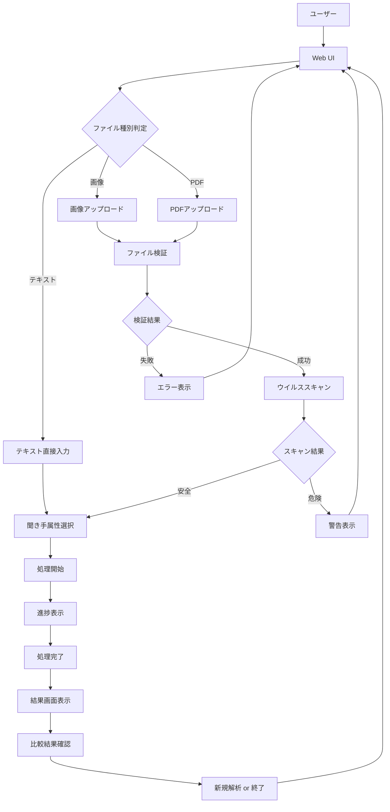
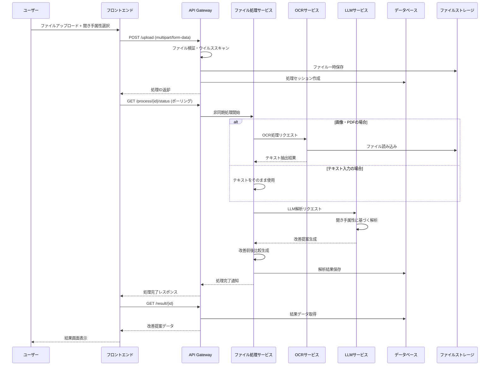
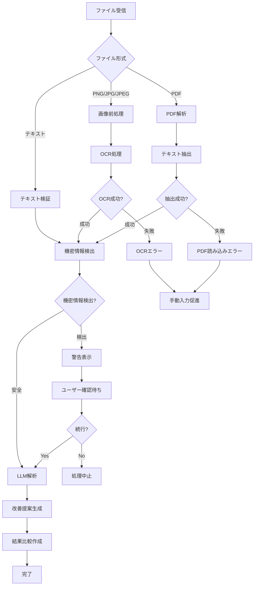
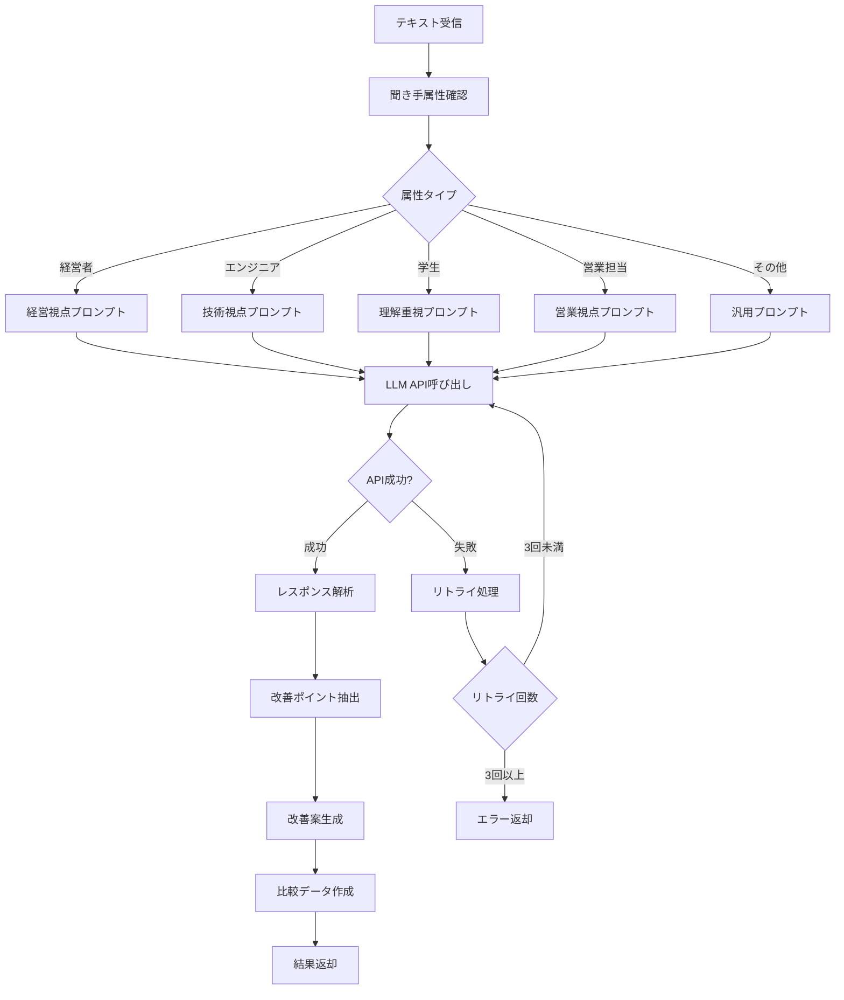
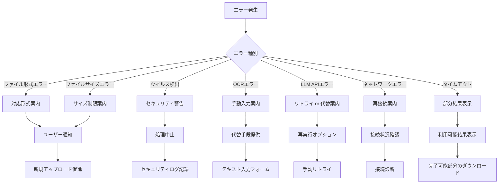
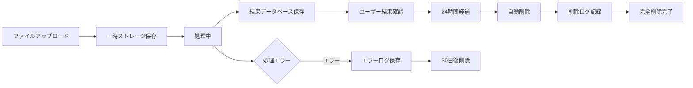

# データフロー図

## ユーザーインタラクションフロー

```mermaid
flowchart TD
    A[ユーザー] --> B[Web UI]
    B --> C{ファイル種別判定}
    
    C -->|画像| D[画像アップロード]
    C -->|PDF| E[PDFアップロード]
    C -->|テキスト| F[テキスト直接入力]
    
    D --> G[ファイル検証]
    E --> G
    F --> H[聞き手属性選択]
    
    G --> I{検証結果}
    I -->|成功| J[ウイルススキャン]
    I -->|失敗| K[エラー表示]
    
    J --> L{スキャン結果}
    L -->|安全| H
    L -->|危険| M[警告表示]
    
    H --> N[処理開始]
    N --> O[進捗表示]
    O --> P[処理完了]
    P --> Q[結果画面表示]
    
    K --> B
    M --> B
    Q --> R[比較結果確認]
    R --> S[新規解析 or 終了]
    S --> B
```

## データ処理フロー

```mermaid
sequenceDiagram
    participant U as ユーザー
    participant F as フロントエンド
    participant G as API Gateway
    participant P as ファイル処理サービス
    participant O as OCRサービス
    participant L as LLMサービス
    participant D as データベース
    participant S as ファイルストレージ
    
    U->>F: ファイルアップロード + 聞き手属性選択
    F->>G: POST /upload (multipart/form-data)
    
    G->>G: ファイル検証・ウイルススキャン
    G->>S: ファイル一時保存
    G->>D: 処理セッション作成
    G-->>F: 処理ID返却
    
    F->>G: GET /process/{id}/status (ポーリング)
    G->>P: 非同期処理開始
    
    alt 画像・PDFの場合
        P->>O: OCR処理リクエスト
        O->>S: ファイル読み込み
        O-->>P: テキスト抽出結果
    else テキスト入力の場合
        P->>P: テキストをそのまま使用
    end
    
    P->>L: LLM解析リクエスト
    L->>L: 聞き手属性に基づく解析
    L-->>P: 改善提案生成
    
    P->>P: 改善前後比較生成
    P->>D: 解析結果保存
    P-->>G: 処理完了通知
    
    G-->>F: 処理完了レスポンス
    F->>G: GET /result/{id}
    G->>D: 結果データ取得
    G-->>F: 改善提案データ
    F-->>U: 結果画面表示
```

## ファイル処理詳細フロー

```mermaid
flowchart TD
    A[ファイル受信] --> B{ファイル形式}
    
    B -->|PNG/JPG/JPEG| C[画像前処理]
    B -->|PDF| D[PDF解析]
    B -->|テキスト| E[テキスト検証]
    
    C --> F[OCR処理]
    D --> G[テキスト抽出]
    
    F --> H{OCR成功?}
    G --> I{抽出成功?}
    E --> J[機密情報検出]
    
    H -->|成功| J
    H -->|失敗| K[OCRエラー]
    I -->|成功| J
    I -->|失敗| L[PDF読み込みエラー]
    
    J --> M{機密情報検出?}
    M -->|検出| N[警告表示]
    M -->|安全| O[LLM解析]
    
    O --> P[改善提案生成]
    P --> Q[結果比較作成]
    Q --> R[完了]
    
    K --> S[手動入力促進]
    L --> S
    N --> T[ユーザー確認待ち]
    T --> U{続行?}
    U -->|Yes| O
    U -->|No| V[処理中止]
```

## LLM解析処理フロー

```mermaid
flowchart TD
    A[テキスト受信] --> B[聞き手属性確認]
    
    B --> C{属性タイプ}
    C -->|経営者| D[経営視点プロンプト]
    C -->|エンジニア| E[技術視点プロンプト]
    C -->|学生| F[理解重視プロンプト]
    C -->|営業担当| G[営業視点プロンプト]
    C -->|その他| H[汎用プロンプト]
    
    D --> I[LLM API呼び出し]
    E --> I
    F --> I
    G --> I
    H --> I
    
    I --> J{API成功?}
    J -->|成功| K[レスポンス解析]
    J -->|失敗| L[リトライ処理]
    
    L --> M{リトライ回数}
    M -->|3回未満| I
    M -->|3回以上| N[エラー返却]
    
    K --> O[改善ポイント抽出]
    O --> P[改善案生成]
    P --> Q[比較データ作成]
    Q --> R[結果返却]
```

## エラーハンドリングフロー

```mermaid
flowchart TD
    A[エラー発生] --> B{エラー種別}
    
    B -->|ファイル形式エラー| C[対応形式案内]
    B -->|ファイルサイズエラー| D[サイズ制限案内]
    B -->|ウイルス検出| E[セキュリティ警告]
    B -->|OCRエラー| F[手動入力案内]
    B -->|LLM APIエラー| G[リトライ or 代替案内]
    B -->|ネットワークエラー| H[再接続案内]
    B -->|タイムアウト| I[部分結果表示]
    
    C --> J[ユーザー通知]
    D --> J
    E --> K[処理中止]
    F --> L[代替手段提供]
    G --> M[再実行オプション]
    H --> N[接続状況確認]
    I --> O[利用可能結果表示]
    
    J --> P[新規アップロード促進]
    K --> Q[セキュリティログ記録]
    L --> R[テキスト入力フォーム]
    M --> S[手動リトライ]
    N --> T[接続診断]
    O --> U[完了可能部分のダウンロード]
```

## データライフサイクル

```mermaid
flowchart LR
    A[ファイルアップロード] --> B[一時ストレージ保存]
    B --> C[処理中]
    C --> D[結果データベース保存]
    D --> E[ユーザー結果確認]
    E --> F[24時間経過]
    F --> G[自動削除]
    
    C --> H{処理エラー}
    H -->|エラー| I[エラーログ保存]
    I --> J[30日後削除]
    
    G --> K[削除ログ記録]
    K --> L[完全削除完了]
```

---

作成日: 2025-08-02  
バージョン: 1.0  
更新者: Claude Code