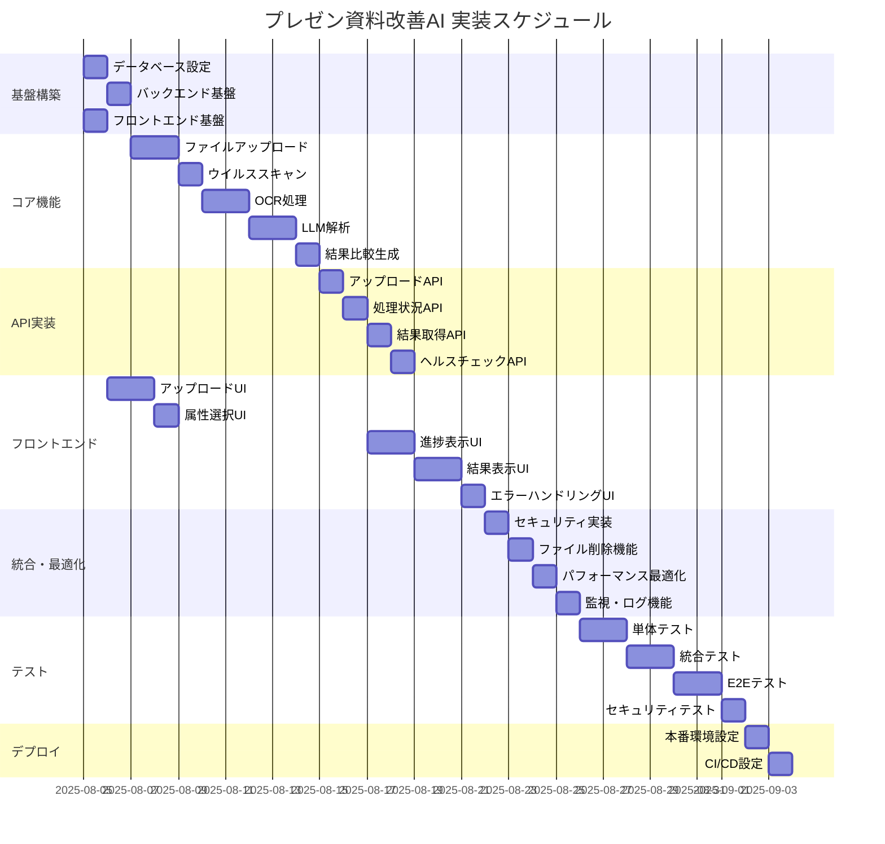

# プレゼン資料改善AI 実装タスク

## 概要

**全タスク数**: 32  
**推定作業時間**: 120時間（15営業日）  
**クリティカルパス**: TASK-001 → TASK-002 → TASK-003 → TASK-101 → TASK-201 → TASK-301  

## タスク一覧

### フェーズ1: 基盤構築（推定24時間）

#### TASK-001: データベース・インフラ初期設定

- [ ] **タスク完了**
- **タスクタイプ**: DIRECT
- **要件リンク**: NFR-301, NFR-302
- **依存タスク**: なし
- **実装詳細**:
  - PostgreSQLのDockerコンテナ設定
  - Redisキャッシュサーバー設定
  - docker-compose.yamlの作成
  - 初期スキーマの適用
  - データベース接続プール設定
- **テスト要件**:
  - [ ] データベース接続テスト
  - [ ] Redis接続テスト
  - [ ] スキーマ検証テスト
  - [ ] パフォーマンステスト（接続数）
- **完了条件**:
  - [ ] PostgreSQL・Redisが起動している
  - [ ] 全テーブル・インデックスが作成されている
  - [ ] 基本的なCRUD操作が動作する

#### TASK-002: バックエンド基盤設定

- [ ] **タスク完了**
- **タスクタイプ**: DIRECT
- **要件リンク**: REQ-001, REQ-002, REQ-003
- **依存タスク**: TASK-001
- **実装詳細**:
  - Honoフレームワークの初期設定
  - TypeScript・ESLint・Prettier設定
  - Prisma ORM設定
  - 環境変数管理（.env設定）
  - ログ設定（structured logging）
  - CORS・セキュリティヘッダー設定
- **テスト要件**:
  - [ ] サーバー起動テスト
  - [ ] 基本的なミドルウェア動作テスト
  - [ ] 環境変数読み込みテスト
- **完了条件**:
  - [ ] サーバーがローカルホストで起動する
  - [ ] 基本的なHTTPリクエストが処理される
  - [ ] データベース接続が確立される

#### TASK-003: フロントエンド基盤設定

- [ ] **タスク完了**
- **タスクタイプ**: DIRECT
- **要件リンク**: NFR-201, NFR-202, NFR-203
- **依存タスク**: なし（並行実行可能）
- **実装詳細**:
  - Next.js 14プロジェクト初期化
  - Tailwind CSS・Radix UIセットアップ
  - TypeScript設定
  - React Query・Zustand設定
  - ESLint・Prettier設定
  - レスポンシブデザイン基盤
- **テスト要件**:
  - [ ] 開発サーバー起動テスト
  - [ ] TypeScript型チェックテスト
  - [ ] 基本コンポーネント描画テスト
- **UI/UX要件**:
  - [ ] レスポンシブデザイン: モバイル・タブレット・デスクトップ対応
  - [ ] アクセシビリティ: ARIA属性の基本設定
  - [ ] ダークモード対応準備
- **完了条件**:
  - [ ] 開発サーバーが起動する
  - [ ] 基本的なページが表示される
  - [ ] モバイル・デスクトップで正常表示される

### フェーズ2: コア機能実装（推定48時間）

#### TASK-101: ファイルアップロード機能

- [ ] **タスク完了**
- **タスクタイプ**: TDD
- **要件リンク**: REQ-001, REQ-002, REQ-401, REQ-402
- **依存タスク**: TASK-002
- **実装詳細**:
  - マルチパートファイルアップロード処理
  - ファイル形式・サイズ検証
  - 一時ファイル保存
  - ファイルメタデータ保存
  - セッション管理
- **テスト要件**:
  - [ ] 単体テスト: ファイル検証ロジック
  - [ ] 統合テスト: アップロードAPI
  - [ ] 境界値テスト: ファイルサイズ制限
  - [ ] セキュリティテスト: 不正ファイル形式
- **エラーハンドリング**:
  - [ ] ファイルサイズ超過
  - [ ] 非対応ファイル形式
  - [ ] ディスク容量不足
  - [ ] ネットワークエラー
- **完了条件**:
  - [ ] 各ファイル形式（PNG/JPG/PDF）が正常アップロード
  - [ ] ファイルサイズ制限が正しく機能
  - [ ] エラー時に適切なメッセージが返される

#### TASK-102: ウイルススキャン機能

- [ ] **タスク完了**
- **タスクタイプ**: TDD
- **要件リンク**: NFR-101, REQ-404
- **依存タスク**: TASK-101
- **実装詳細**:
  - ClamAV統合
  - 非同期スキャン処理
  - スキャン結果の記録
  - 危険ファイルの自動削除
- **テスト要件**:
  - [ ] 単体テスト: スキャン機能
  - [ ] 統合テスト: 安全ファイル処理
  - [ ] セキュリティテスト: 危険ファイル検出
- **エラーハンドリング**:
  - [ ] ウイルス検出時の処理
  - [ ] スキャンタイムアウト
  - [ ] ClamAVサービス停止
- **完了条件**:
  - [ ] 安全なファイルが正常に処理される
  - [ ] 危険なファイルが適切にブロックされる
  - [ ] スキャン結果がログに記録される

#### TASK-103: OCR処理サービス

- [ ] **タスク完了**
- **タスクタイプ**: TDD
- **要件リンク**: REQ-101, REQ-102, REQ-106
- **依存タスク**: TASK-102
- **実装詳細**:
  - Tesseract.js統合
  - 画像前処理（コントラスト調整、ノイズ除去）
  - PDFテキスト抽出
  - OCR結果の信頼度評価
  - 抽出テキストの後処理
- **テスト要件**:
  - [ ] 単体テスト: OCRロジック
  - [ ] 統合テスト: 各ファイル形式での抽出
  - [ ] パフォーマンステスト: 処理時間
  - [ ] 精度テスト: 既知のテキストでの検証
- **エラーハンドリング**:
  - [ ] OCR処理失敗
  - [ ] 低品質画像の処理
  - [ ] 処理タイムアウト
- **完了条件**:
  - [ ] 各ファイル形式からテキストが抽出される
  - [ ] 抽出精度が実用レベル（80%以上）
  - [ ] エラー時に適切な代替案が提示される

#### TASK-104: LLM解析サービス

- [ ] **タスク完了**
- **タスクタイプ**: TDD
- **要件リンク**: REQ-005, REQ-006, REQ-007, REQ-103, REQ-104, REQ-105
- **依存タスク**: TASK-103
- **実装詳細**:
  - OpenAI API統合
  - 聞き手属性別プロンプト設計
  - 改善提案生成
  - レスポンス解析・構造化
  - トークン使用量管理
- **テスト要件**:
  - [ ] 単体テスト: プロンプト生成
  - [ ] 統合テスト: LLM API呼び出し
  - [ ] 品質テスト: 改善提案の妥当性
  - [ ] パフォーマンステスト: レスポンス時間
- **エラーハンドリング**:
  - [ ] API呼び出し失敗
  - [ ] レート制限
  - [ ] 不適切なコンテンツ検出
  - [ ] トークン制限超過
- **完了条件**:
  - [ ] 各聞き手属性で適切な改善提案が生成される
  - [ ] 改善提案が構造化されて保存される
  - [ ] API使用量が適切に管理される

#### TASK-105: 結果比較生成サービス

- [ ] **タスク完了**
- **タスクタイプ**: TDD
- **要件リンク**: REQ-008
- **依存タスク**: TASK-104
- **実装詳細**:
  - 改善前後のテキスト比較
  - 変更点のハイライト
  - 改善理由の説明生成
  - 比較データのJSON構造化
- **テスト要件**:
  - [ ] 単体テスト: 比較アルゴリズム
  - [ ] 統合テスト: 全体フロー
  - [ ] UIテスト: 比較表示
- **完了条件**:
  - [ ] 改善前後が明確に比較表示される
  - [ ] 変更理由が適切に説明される
  - [ ] データが構造化されて保存される

### フェーズ3: API実装（推定24時間）

#### TASK-201: アップロードAPI実装

- [ ] **タスク完了**
- **タスクタイプ**: TDD
- **要件リンク**: REQ-001, REQ-002, REQ-003, REQ-004
- **依存タスク**: TASK-105
- **実装詳細**:
  - POST /upload エンドポイント
  - マルチパート処理
  - 非同期処理キュー
  - レスポンス形式統一
  - エラーレスポンス標準化
- **テスト要件**:
  - [ ] 単体テスト: リクエスト処理
  - [ ] 統合テスト: E2Eフロー
  - [ ] ロードテスト: 同時アップロード
- **エラーハンドリング**:
  - [ ] 必須パラメータ不足
  - [ ] 不正なファイル形式
  - [ ] サーバーエラー
- **完了条件**:
  - [ ] 仕様通りのレスポンスが返される
  - [ ] エラー時に適切なHTTPステータスが返される
  - [ ] 非同期処理が正常に開始される

#### TASK-202: 処理状況確認API実装

- [ ] **タスク完了**
- **タスクタイプ**: TDD
- **要件リンク**: REQ-201
- **依存タスク**: TASK-201
- **実装詳細**:
  - GET /process/{sessionId}/status エンドポイント
  - 処理進捗の取得
  - ステータス更新機能
  - キャッシュ機能
- **テスト要件**:
  - [ ] 単体テスト: ステータス取得
  - [ ] 統合テスト: 進捗更新
  - [ ] パフォーマンステスト: ポーリング負荷
- **完了条件**:
  - [ ] 処理状況がリアルタイムで取得される
  - [ ] 適切なHTTPステータスが返される
  - [ ] キャッシュが正常に機能する

#### TASK-203: 結果取得API実装

- [ ] **タスク完了**
- **タスクタイプ**: TDD
- **要件リンク**: REQ-203
- **依存タスク**: TASK-202
- **実装詳細**:
  - GET /result/{sessionId} エンドポイント
  - 結果データの取得・整形
  - キャッシュ機能
  - データ圧縮
- **テスト要件**:
  - [ ] 単体テスト: データ取得
  - [ ] 統合テスト: 結果フォーマット
  - [ ] パフォーマンステスト: レスポンス時間
- **完了条件**:
  - [ ] 仕様通りの結果データが返される
  - [ ] データが適切に構造化されている
  - [ ] レスポンス時間が要件を満たす

#### TASK-204: ヘルスチェック・統計API実装

- [ ] **タスク完了**
- **タスクタイプ**: TDD
- **要件リンク**: NFR-301, NFR-302
- **依存タスク**: TASK-203
- **実装詳細**:
  - GET /health エンドポイント
  - GET /stats エンドポイント
  - システム監視機能
  - 統計データ集計
- **テスト要件**:
  - [ ] 単体テスト: ヘルスチェック
  - [ ] 統合テスト: 統計取得
  - [ ] 負荷テスト: 監視負荷
- **完了条件**:
  - [ ] システム状態が正確に報告される
  - [ ] 統計データが適切に集計される
  - [ ] 監視システムとの連携が動作する

### フェーズ4: フロントエンド実装（推定32時間）

#### TASK-301: ファイルアップロードUI

- [ ] **タスク完了**
- **タスクタイプ**: TDD
- **要件リンク**: REQ-001, REQ-002, REQ-003, NFR-201
- **依存タスク**: TASK-003, TASK-201
- **実装詳細**:
  - ドラッグ&ドロップ機能
  - ファイル選択UI
  - プレビュー機能
  - バリデーション表示
  - React Dropzone統合
- **UI/UX要件**:
  - [ ] ローディング状態: アップロード進捗バー
  - [ ] エラー表示: インラインエラーメッセージ
  - [ ] モバイル対応: タッチ操作対応
  - [ ] アクセシビリティ: スクリーンリーダー対応、キーボード操作
- **テスト要件**:
  - [ ] コンポーネントテスト: UI動作
  - [ ] E2Eテスト: ファイルアップロードフロー
  - [ ] レスポンシブテスト: 各デバイスサイズ
  - [ ] アクセシビリティテスト: ARIA属性
- **完了条件**:
  - [ ] ドラッグ&ドロップが直感的に動作する
  - [ ] ファイル検証エラーが適切に表示される
  - [ ] モバイル端末で正常に動作する

#### TASK-302: 聞き手属性選択UI

- [ ] **タスク完了**
- **タスクタイプ**: TDD
- **要件リンク**: REQ-004
- **依存タスク**: TASK-301
- **実装詳細**:
  - ラジオボタン・セレクト形式
  - 各属性の説明表示
  - 状態管理（Zustand）
  - バリデーション
- **UI/UX要件**:
  - [ ] 直感的な選択UI: アイコン + 説明文
  - [ ] ホバー効果: 選択候補のハイライト
  - [ ] モバイル対応: タッチフレンドリーなサイズ
  - [ ] アクセシビリティ: フォーカス管理
- **テスト要件**:
  - [ ] コンポーネントテスト: 選択状態管理
  - [ ] 統合テスト: フォーム送信
  - [ ] アクセシビリティテスト
- **完了条件**:
  - [ ] 全ての聞き手属性が選択可能
  - [ ] 選択状態が適切に管理される
  - [ ] フォームバリデーションが動作する

#### TASK-303: 処理進捗表示UI

- [ ] **タスク完了**
- **タスクタイプ**: TDD
- **要件リンク**: REQ-201
- **依存タスク**: TASK-302, TASK-202
- **実装詳細**:
  - プログレスバー表示
  - ステップ表示（アップロード→解析→完了）
  - リアルタイム更新（ポーリング）
  - エラー状態表示
- **UI/UX要件**:
  - [ ] 視覚的進捗表示: プログレスバー + パーセンテージ
  - [ ] ステップ表示: 現在の処理段階を明示
  - [ ] エラー表示: わかりやすいエラーメッセージ
  - [ ] キャンセル機能: 処理中断ボタン
- **テスト要件**:
  - [ ] コンポーネントテスト: 進捗更新
  - [ ] 統合テスト: API連携
  - [ ] パフォーマンステスト: ポーリング頻度
- **完了条件**:
  - [ ] 処理進捗がリアルタイムで更新される
  - [ ] エラー時に適切なメッセージが表示される
  - [ ] ユーザーが現在の状況を理解できる

#### TASK-304: 結果比較表示UI

- [ ] **タスク完了**
- **タスクタイプ**: TDD
- **要件リンク**: REQ-008, NFR-204
- **依存タスク**: TASK-303, TASK-203
- **実装詳細**:
  - Before/After比較表示
  - 変更箇所のハイライト
  - 改善提案リスト表示
  - エクスポート機能
- **UI/UX要件**:
  - [ ] 視覚的比較: サイドバイサイド表示
  - [ ] ハイライト: 変更箇所の色分け
  - [ ] 改善提案: カード型UI with 優先度表示
  - [ ] エクスポート: PDF/テキスト出力ボタン
  - [ ] モバイル対応: スタック表示
- **テスト要件**:
  - [ ] コンポーネントテスト: 比較表示
  - [ ] E2Eテスト: 全体フロー
  - [ ] レスポンシブテスト
  - [ ] パフォーマンステスト: 大量データ表示
- **完了条件**:
  - [ ] 改善前後が視覚的に比較できる
  - [ ] 変更理由が理解しやすく表示される
  - [ ] モバイル端末でも見やすく表示される

#### TASK-305: エラーハンドリング・通知UI

- [ ] **タスク完了**
- **タスクタイプ**: TDD
- **要件リンク**: REQ-202, EDGE-001～006
- **依存タスク**: TASK-304
- **実装詳細**:
  - トースト通知システム
  - エラー画面・モーダル
  - リトライ機能UI
  - ネットワークエラー対応
- **UI/UX要件**:
  - [ ] トースト通知: 成功・警告・エラーの色分け
  - [ ] エラーモーダル: 詳細情報 + 対処法表示
  - [ ] リトライボタン: 再実行が容易
  - [ ] オフライン対応: ネットワーク状態表示
- **テスト要件**:
  - [ ] コンポーネントテスト: 通知表示
  - [ ] 統合テスト: エラーシナリオ
  - [ ] ユーザビリティテスト
- **完了条件**:
  - [ ] すべてのエラーが適切に表示される
  - [ ] ユーザーが次のアクションを理解できる
  - [ ] リトライ機能が正常に動作する

### フェーズ5: 統合・最適化（推定16時間）

#### TASK-401: セキュリティ実装

- [ ] **タスク完了**
- **タスクタイプ**: TDD
- **要件リンク**: NFR-101, NFR-102, NFR-103, NFR-104
- **依存タスク**: TASK-305
- **実装詳細**:
  - CORS設定
  - レート制限実装
  - セキュリティヘッダー設定
  - 機密情報検出機能
  - SSL/TLS設定
- **テスト要件**:
  - [ ] セキュリティテスト: OWASP Top 10
  - [ ] 負荷テスト: DDoS耐性
  - [ ] 侵入テスト: 脆弱性スキャン
- **完了条件**:
  - [ ] セキュリティヘッダーが適切に設定されている
  - [ ] レート制限が正常に機能する
  - [ ] 機密情報が検出・マスクされる

#### TASK-402: ファイル自動削除機能

- [ ] **タスク完了**
- **タスクタイプ**: TDD
- **要件リンク**: REQ-403
- **依存タスク**: TASK-401
- **実装詳細**:
  - バッチ処理による定期削除
  - ファイル有効期限管理
  - ストレージ使用量監視
  - 削除ログ記録
- **テスト要件**:
  - [ ] 単体テスト: 削除ロジック
  - [ ] 統合テスト: バッチ実行
  - [ ] パフォーマンステスト: 大量ファイル削除
- **完了条件**:
  - [ ] 24時間後にファイルが自動削除される
  - [ ] 削除処理がログに記録される
  - [ ] ストレージ使用量が管理されている

#### TASK-403: パフォーマンス最適化

- [ ] **タスク完了**
- **タスクタイプ**: TDD
- **要件リンク**: NFR-001, NFR-002, NFR-003
- **依存タスク**: TASK-402
- **実装詳細**:
  - データベースクエリ最適化
  - キャッシュ戦略実装
  - 画像最適化
  - コード分割・遅延読み込み
- **テスト要件**:
  - [ ] パフォーマンステスト: レスポンス時間
  - [ ] ロードテスト: 同時接続数
  - [ ] メモリ使用量テスト
- **完了条件**:
  - [ ] 5MBファイルが30秒以内に処理される
  - [ ] 10ユーザー同時処理が可能
  - [ ] フロントエンドの初期読み込みが3秒以内

#### TASK-404: 監視・ログ機能

- [ ] **タスク完了**
- **タスクタイプ**: DIRECT
- **要件リンク**: NFR-104, NFR-301
- **依存タスク**: TASK-403
- **実装詳細**:
  - 構造化ログ実装
  - メトリクス収集
  - アラート設定
  - ダッシュボード作成
- **テスト要件**:
  - [ ] ログ出力テスト
  - [ ] メトリクス収集テスト
  - [ ] アラート動作テスト
- **完了条件**:
  - [ ] すべての重要な操作がログに記録される
  - [ ] システムメトリクスが収集されている
  - [ ] 異常時にアラートが発生する

### フェーズ6: テスト・品質保証（推定24時間）

#### TASK-501: 単体テストスイート

- [ ] **タスク完了**
- **タスクタイプ**: TDD
- **要件リンク**: 全要件
- **依存タスク**: 各機能実装タスク
- **実装詳細**:
  - Jest/Vitestセットアップ
  - 全モジュールの単体テスト
  - テストカバレッジ90%以上
  - モック・スパイ機能
- **テスト要件**:
  - [ ] 全関数・メソッドのテスト
  - [ ] 境界値テスト
  - [ ] エラーケーステスト
- **完了条件**:
  - [ ] すべての単体テストが通る
  - [ ] カバレッジが90%以上
  - [ ] CI/CDでテストが自動実行される

#### TASK-502: 統合テストスイート

- [ ] **タスク完了**
- **タスクタイプ**: TDD
- **要件リンク**: 全要件
- **依存タスク**: TASK-501
- **実装詳細**:
  - API統合テスト
  - データベース統合テスト
  - 外部サービス統合テスト
  - テストデータ管理
- **テスト要件**:
  - [ ] 全APIエンドポイントのテスト
  - [ ] データベース操作テスト
  - [ ] LLM API統合テスト
- **完了条件**:
  - [ ] すべての統合テストが通る
  - [ ] テストデータが適切に管理される
  - [ ] 外部依存関係が正常に動作する

#### TASK-503: E2Eテストスイート

- [ ] **タスク完了**
- **タスクタイプ**: TDD
- **要件リンク**: 全ユーザーストーリー
- **依存タスク**: TASK-502, TASK-404
- **実装詳細**:
  - Playwright/Cypressセットアップ
  - 主要ユーザーフローのテスト
  - クロスブラウザテスト
  - モバイルテスト
- **UI/UX要件**:
  - [ ] 全デバイスサイズでのテスト
  - [ ] 各ブラウザでの動作確認
  - [ ] アクセシビリティテスト
- **テスト要件**:
  - [ ] ファイルアップロード〜結果表示の全フロー
  - [ ] エラーシナリオテスト
  - [ ] パフォーマンステスト
- **完了条件**:
  - [ ] 全E2Eテストが通る
  - [ ] 主要ブラウザで正常動作
  - [ ] モバイル端末で正常動作

#### TASK-504: セキュリティ・負荷テスト

- [ ] **タスク完了**
- **タスクタイプ**: TDD
- **要件リンク**: NFR-101～104, NFR-301～302
- **依存タスク**: TASK-503
- **実装詳細**:
  - セキュリティスキャン
  - 負荷テスト（Apache JMeter）
  - 脆弱性テスト
  - パフォーマンスベンチマーク
- **テスト要件**:
  - [ ] OWASP ZAP脆弱性スキャン
  - [ ] 同時接続数負荷テスト
  - [ ] DDoS攻撃シミュレーション
- **完了条件**:
  - [ ] セキュリティ脆弱性が検出されない
  - [ ] 要求された負荷に耐えられる
  - [ ] パフォーマンス要件を満たす

### フェーズ7: デプロイ準備（推定8時間）

#### TASK-601: 本番環境設定

- [ ] **タスク完了**
- **タスクタイプ**: DIRECT
- **要件リンク**: NFR-301, NFR-302
- **依存タスク**: TASK-504
- **実装詳細**:
  - Docker本番用Dockerfile
  - 環境変数設定
  - SSL証明書設定
  - ログ設定
  - 監視設定
- **テスト要件**:
  - [ ] 本番環境動作確認
  - [ ] SSL証明書確認
  - [ ] 監視動作確認
- **完了条件**:
  - [ ] 本番環境でアプリケーションが起動する
  - [ ] SSL通信が正常に動作する
  - [ ] 監視システムが動作する

#### TASK-602: CI/CDパイプライン

- [ ] **タスク完了**
- **タスクタイプ**: DIRECT
- **要件リンク**: 全要件（品質保証）
- **依存タスク**: TASK-601
- **実装詳細**:
  - GitHub Actions設定
  - 自動テスト実行
  - 自動デプロイ設定
  - ロールバック機能
- **テスト要件**:
  - [ ] CI/CDパイプライン動作確認
  - [ ] 自動テスト実行確認
  - [ ] デプロイ動作確認
- **完了条件**:
  - [ ] コミット時に自動テストが実行される
  - [ ] テスト通過時に自動デプロイされる
  - [ ] ロールバック機能が動作する

## 実行順序

## 並行実行可能なタスク

### フェーズ1
- TASK-001（データベース）と TASK-003（フロントエンド基盤）は並行実行可能

### フェーズ4
- TASK-301～304（各UI）は一部並行実行可能（依存関係を確認）

### フェーズ6  
- TASK-501（単体テスト）の一部は各機能実装完了後に並行実行可能

## 重要なマイルストーン

1. **MVP完成** (TASK-304完了時): 基本的な機能が動作
2. **α版完成** (TASK-404完了時): 本格的な動作確認が可能
3. **β版完成** (TASK-504完了時): 本番投入可能な品質
4. **リリース準備完了** (TASK-602完了時): 本番環境デプロイ可能

---

作成日: 2025-08-02  
バージョン: 1.0  
更新者: Claude Code