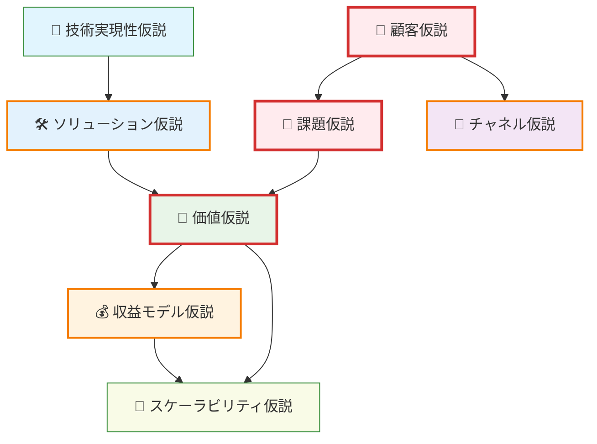
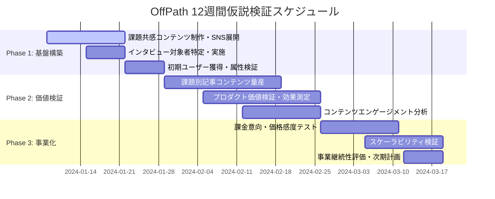
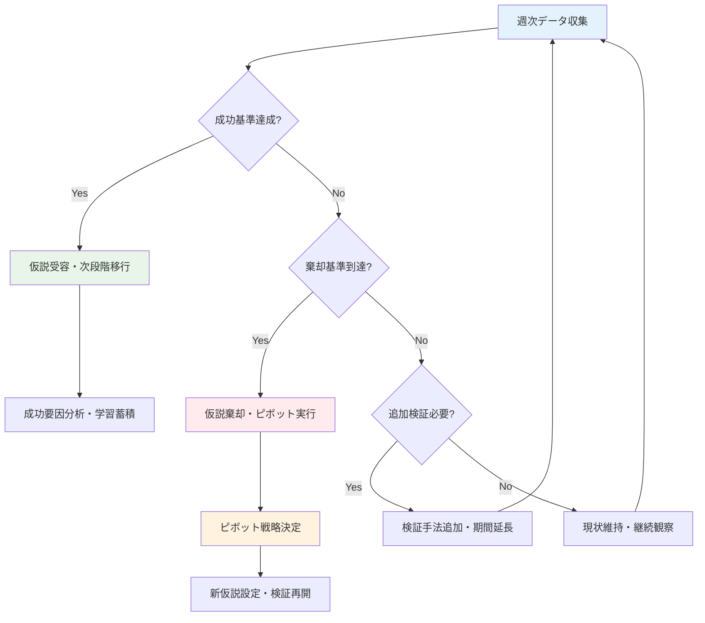

# 事業仮説検証計画

## 📊 事業概要・現状分析

### サービス概要
**OffPath**は、母国語のレビューや記事が一切存在しない「真の隠れ名所」を発見し、冒険志向の旅行者に予測不可能で本物の現地体験を提供する旅行計画サービスです。

### 提供価値
- 🎯 **真の現地体験**: 観光客向けでない、現地人が本当に愛する場所での体験
- 🎲 **予測不可能な刺激**: 計画されすぎない、サプライズに満ちた旅程
- 🏆 **独占的な体験**: 同じ国の人がまだ誰も行ったことのない場所での優越感
- 📖 **ストーリー性**: 帰国後に語れる、ユニークで印象的な旅行体験

### 市場機会・課題認識
**ターゲット市場**: 冒険志向の経験豊富な旅行者（25-45歳）および体験重視の若年層（22-30歳）

**市場課題**:
- 有名観光地の画一化による旅行体験の物足りなさ
- 現地語ができないことによる真のローカル情報へのアクセス困難
- 既存旅行サービスでは得られない「予測不可能な刺激」への潜在需要

---

## 🎯 検証対象仮説

### 仮説関係性図



### 検証対象仮説一覧

| 仮説カテゴリ | 仮説内容 | 検証優先度 | リスクレベル | 想定実装状況 |
|------------|----------|------------|-------------|-------------|
| 👤 **顧客仮説** | 冒険志向の旅行者（25-45歳）が実際のターゲット層である | 🔥高 | ⚠️高 | 🟡 基本属性データ取得中 |
| 🧱 **課題仮説** | 「観光地化への物足りなさ」「真のローカル体験への渇望」が深刻な課題である | 🔥高 | ⚠️高 | 🔴 設計書のみ、検証未実施 |
| 💎 **価値仮説** | 隠れ名所での予測不可能な体験が、既存サービスを上回る価値を提供できる | 🔥高 | ⚠️中 | 🟡 MVP機能で一部検証中 |
| 🛠️ **ソリューション仮説** | AI解析による隠れ名所発見とカオス旅程生成が課題解決手段として有効である | 🔵中 | ⚠️中 | 🔴 AI機能未実装 |
| 💰 **収益モデル仮説** | プレミアム旅程サービスに対して月額2,980円〜の課金意向がある | 🔵中 | ⚠️高 | 🔴 課金機能未実装 |
| 🚪 **チャネル仮説** | 旅行体験コンテンツマーケティングでターゲット層に効率的にリーチできる | 🔵中 | ⚠️中 | 🟡 SNS流入のみ、検証不十分 |
| 🌱 **スケーラビリティ仮説** | 他地域・他セグメント（ビジネス旅行者等）へ展開可能である | 🟡低 | ⚠️低 | 🔴 現セグメント注力中 |
| 🤖 **技術実現性仮説** | 多言語レビュー解析とカオス旅程生成が技術的・コスト的に実現可能である | 🔥高 | ⚠️中 | 🟡 MVP技術検証中 |

### コア仮説の特定

**最重要コア仮説**: 👤顧客仮説 + 🧱課題仮説
- 全ての仮説の前提となる「誰に・何の課題を解決するか」
- この2つが棄却された場合、サービス全体のピボットが必要

**検証順序**: 👤顧客仮説 → 🧱課題仮説 → 💎価値仮説 → 🛠️ソリューション仮説 → 💰収益モデル仮説

---

## 📈 検証戦略・スケジュール

### 3段階検証アプローチ

#### Phase 1: 基盤構築・仮説検証型ユーザー獲得（Week 1-3）
**目標**: 顧客・課題仮説の検証とコンテンツ経由初期ユーザー獲得

#### Phase 2: コンテンツ拡張・価値仮説検証（Week 4-7）  
**目標**: 価値提供の実証とコンテンツマーケティング効果測定

#### Phase 3: 事業化・スケール検証（Week 8-12）
**目標**: 収益モデル検証とスケーラビリティ評価

### 検証スケジュール



### 段階別実行計画

#### 📊 Phase 1: 基盤構築・仮説検証型ユーザー獲得（Week 1-3）

| アクション | 対象仮説 | 必要リソース | 成功の判断基準 | 実装要件 |
|----------|----------|-------------|----------------|----------|
| 課題共感動画・記事制作・SNS展開 | 👤顧客仮説、🧱課題仮説 | マーケ1名、デザイナー0.5名 | 「観光地疲れ」動画3本投稿、合計3,000いいね以上 | 🔴 動画制作・SNS広告予算 |
| 高反応ユーザーインタビュー実施 | 👤顧客仮説、🧱課題仮説 | PM1名、マーケ0.5名 | 高反応ユーザー20名特定、10名インタビュー実施 | 🔴 SNS分析・インタビュー設計 |
| 課題別記事コンテンツ制作 | 🧱課題仮説、🚪チャネル仮説 | マーケ1名、ライター0.5名 | 課題別記事5本公開、検索上位狙い | 🔴 SEO対策・ライティング |
| コンテンツ経由初期ユーザー獲得 | 👤顧客仮説、🚪チャネル仮説 | マーケ1名、PM0.5名 | ターゲット層50名登録、属性一致度80%以上 | 🔴 コンテンツ導線最適化 |

#### 🔍 Phase 2: コンテンツ拡張・価値仮説検証（Week 4-7）

| アクション | 対象仮説 | 必要リソース | 成功の判断基準 | 実装要件 |
|----------|----------|-------------|----------------|----------|
| 課題別記事コンテンツ量産 | 🧱課題仮説、🚪チャネル仮説 | マーケ1名、ライター1名 | 週3記事公開、月間PV 15,000以上 | 🔴 ライティング・SEO・SNS予算 |
| コンテンツエンゲージメント分析 | 👤顧客仮説、🧱課題仮説 | マーケ1名、アナリスト1名 | セグメント別反応率・課題深度分析 | 🔴 SNS分析・GA4詳細設定 |
| プロダクト価値検証・効果測定 | 💎価値仮説、🛠️ソリューション仮説 | アナリスト1名、PM1名 | 旅行体験満足度4.5以上/5.0、リピート意向80%以上 | 🟡 継続追跡・測定機能追加 |
| コンテンツ経由ユーザー拡大 | 🚪チャネル仮説、💎価値仮説 | マーケ1名、PM0.5名 | 記事・動画経由200名登録、課題共感度検証 | 🟢 Phase1コンテンツ基盤活用 |

#### 🚀 Phase 3: 事業化・スケール検証（Week 8-12）

| アクション | 対象仮説 | 必要リソース | 成功の判断基準 | 実装要件 |
|----------|----------|-------------|----------------|----------|
| コンテンツ品質×課金意向相関分析 | 💰収益モデル仮説 | アナリスト1名、PM0.5名 | 高エンゲージメント層の課金転換率10%以上 | 🟢 既存データ分析 |
| 課金機能実装・価格感度テスト | 💰収益モデル仮説 | エンジニア1名、PM0.5名 | 課金転換率5%以上、ARPU 2,500円以上 | 🔴 決済・課金機能開発 |
| コンテンツマーケティングスケール検証 | 🚪チャネル仮説、🌱スケーラビリティ仮説 | マーケ1名 | 複数チャネルでCPA比較、他セグメント反応検証 | 🔴 マルチチャネル・セグメント展開 |
| AI機能技術検証・ROI評価 | 🤖技術実現性仮説、🛠️ソリューション仮説 | エンジニア2名、PM1名 | AI解析精度80%以上、開発コスト回収期間算出 | 🔴 AI機能プロトタイプ開発 |

---

## 📊 測定・分析体制

### メトリクス定義・測定方法

| 仮説 | 主要メトリクス | 測定方法 | 成功基準 | 棄却基準 |
|------|----------------|----------|----------|----------|
| 👤 顧客仮説 | ターゲット層比率、コンテンツ反応率、流入経路別属性 | 登録フォーム、SNS分析、GA4 | 想定ペルソナ70%以上、高反応層一致80%以上 | 想定外ユーザー60%以上 |
| 🧱 課題仮説 | 課題別コンテンツエンゲージメント、課題深刻度スコア | SNS反応分析、インタビュー、アンケート | エンゲージメント率12%以上、課題深刻度4.0以上/5.0 | エンゲージメント率5%未満、課題深刻度2.5未満/5.0 |
| 💎 価値仮説 | コンテンツ→登録転換率、旅行体験満足度、NPS | GA4、アプリ内測定、行動ログ | 転換率5%以上、満足度4.5以上/5.0、NPS > 50 | 転換率1%未満、満足度3.0未満/5.0、NPS < 0 |
| 🛠️ ソリューション仮説 | 機能利用率、AI推薦精度、ユーザビリティスコア | アプリ内ログ、精度測定、ユーザビリティテスト | コア機能利用率80%以上、AI精度80%以上 | コア機能利用率40%未満、AI精度60%未満 |
| 💰 収益モデル仮説 | 課金転換率、ARPU、価格感度指数 | 決済ログ、価格テスト、アンケート | 課金転換率5%以上、ARPU 2,500円以上 | 課金転換率2%未満、ARPU 1,000円未満 |
| 🚪 チャネル仮説 | コンテンツ別流入効率、SNSプラットフォーム別CVR | SNS分析、GA4、流入経路分析 | コンテンツ経由75%以上、記事CVR 4%以上 | コンテンツ経由40%未満、記事CVR 1%未満 |

### データ収集・分析体制

#### 📈 分析ツール構成
- **仮説トラッキング**: Notion Database
- **ユーザー行動分析**: Google Analytics 4, Mixpanel
- **コンテンツマーケティング**: SNS Insights, Canva Pro
- **ユーザーインタビュー**: Zoom, Loom
- **A/Bテスト**: Firebase A/B Testing
- **SEO・コンテンツ分析**: Google Search Console, Ahrefs

#### 📊 週次分析サイクル
- **月曜**: 前週実績の仮説別評価・データ更新
- **水曜**: 中間チェック・軌道修正判断
- **金曜**: 週次レビュー・次週計画調整

---

## ⚠️ リスク管理・意思決定

### 仮説棄却時の対応策

#### 👤 顧客仮説棄却時
- **軽微な乖離（30%未満）**: ペルソナ修正・メッセージング調整
- **中程度乖離（30-50%）**: ターゲット層拡張・セカンダリーペルソナ重視
- **重大な乖離（50%以上）**: 完全ピボット・新ターゲット策定

#### 🧱 課題仮説棄却時  
- **課題深刻度不足**: 課題の再定義・より深い課題の発掘
- **課題内容相違**: 実際の課題に基づくソリューション再設計
- **課題存在しない**: サービスコンセプト根本見直し

#### 💎 価値仮説棄却時
- **価値実感不足**: 価値提供方法の改善・UX向上
- **価値内容相違**: ユーザーが求める真の価値の特定・ピボット
- **競合優位性不足**: 差別化要素の強化・独自価値の創出

### 意思決定フロー



### ピボット判断基準

#### 🚨 緊急ピボット（2週間以内）
- 顧客仮説の重大な乖離（想定外ユーザー70%以上）
- 課題仮説の完全否定（課題深刻度2.0未満/5.0）
- 技術実現性の致命的問題（実現不可能判明）

#### ⚠️ 計画ピボット（4週間以内）
- 価値仮説の継続的棄却（満足度3.0未満継続）
- チャネル仮説の効果不足（CVR 1%未満継続）
- 収益モデル仮説の困難（課金転換率1%未満）

---

## 🤝 運用体制・ツール

### チーム体制・役割分担

#### 👥 推奨チーム構成（4-6名）
- **PM（プロダクトマネージャー）**: 仮説管理・全体統括・意思決定
- **マーケティング**: コンテンツ制作・SNS運用・ユーザー獲得
- **エンジニア**: 機能開発・データ基盤・分析環境構築
- **データアナリスト**: 仮説検証・メトリクス分析・レポート作成
- **デザイナー**: UI/UX・コンテンツデザイン・ブランディング
- **ライター（外注可）**: 記事コンテンツ制作・SEO対策

#### 🎯 役割別責任範囲
| 役割 | 主担当仮説 | 週次作業量 | 主要成果物 |
|------|-----------|-----------|-----------|
| PM | 全仮説統括・意思決定 | 40時間 | 仮説状態更新・ピボット判断・チーム調整 |
| マーケティング | 👤顧客、🧱課題、🚪チャネル仮説 | 40時間 | コンテンツ制作・SNS運用・ユーザー獲得 |
| エンジニア | 🤖技術実現性、🛠️ソリューション仮説 | 35時間 | 機能開発・データ基盤・分析環境 |
| アナリスト | 💎価値、💰収益モデル仮説 | 30時間 | データ分析・レポート・検証設計 |

### 仮説管理ツール・ワークフロー

#### 📋 仮説管理テンプレート（Notion）
```
## 仮説名: [仮説カテゴリ] [具体的仮説内容]
- **状態**: [検証中/受容/棄却/保留]
- **優先度**: [高/中/低]  
- **検証期間**: [Week X - Week Y]
- **担当者**: [名前]
- **成功基準**: [具体的数値]
- **現在値**: [最新データ]
- **次回アクション**: [具体的な次の検証ステップ]
- **関連仮説**: [依存関係のある他仮説]
```

#### 🔄 週次ワークフロー
1. **月曜 9:00**: 前週データ集計・仮説状態更新
2. **月曜 10:00**: チーム全体仮説レビューミーティング（30分）
3. **水曜 15:00**: 中間チェック・軌道修正会議（15分）
4. **金曜 16:00**: 週次振り返り・次週計画会議（45分）

### レビューサイクル・コミュニケーションルール

#### 📊 データドリブン意思決定ルール
- **全ての施策**: 検証対象仮説を明記必須
- **仮説状態変更**: 24時間以内にチーム通知
- **データなし意思決定**: 原則禁止（緊急時のみ例外）
- **ピボット検討**: PM判断で緊急ミーティング召集

#### 🎯 学習サイクル設計
- **日次**: 各担当者が担当仮説のデータチェック
- **週次**: チーム全体で仮説状態レビュー・学習共有
- **月次**: 全仮説体系の見直し・戦略調整
- **3ヶ月次**: 事業継続性・スケール戦略評価

#### 📢 コミュニケーション体制
- **Slack**: 日常業務・データ共有・クイック質問
- **Notion**: 仮説管理・ドキュメント・ナレッジベース  
- **Zoom**: 週次ミーティング・インタビュー・レビュー
- **GitHub**: コード管理・技術ドキュメント・開発進捗

---

## 📈 成功指標・継続判断基準

### 3ヶ月後の成功指標
- **👤 顧客仮説**: ターゲット層比率70%以上達成
- **🧱 課題仮説**: 課題深刻度4.0以上確認
- **💎 価値仮説**: NPS 50以上・満足度4.5以上達成
- **💰 収益モデル仮説**: 課金転換率5%以上・ARPU 2,500円以上達成
- **📊 事業継続性**: ユーザー獲得コスト < LTV × 0.3

### サービス継続判断基準
- **継続**: 5つ以上の仮説が成功基準達成
- **ピボット**: 2-4つの仮説達成、重要仮説は受容
- **中止**: 1つ以下の仮説達成、コア仮説棄却