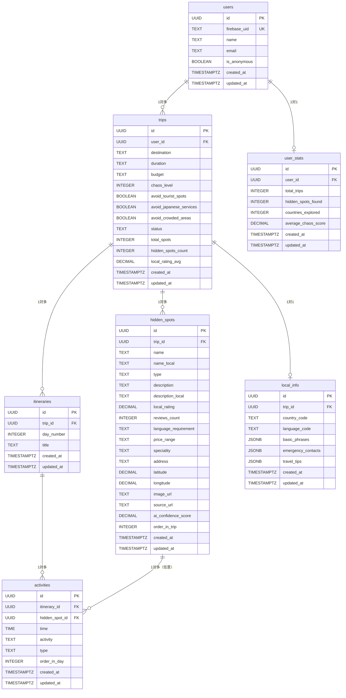

# DB設計書

## 概要
- **DBMS**: PostgreSQL
- **ORM**: Prisma
- **設計方針**: docs/api_development_guideline.md に準拠
- **アーキテクチャ方針**: docs/architecture_guideline.md に準拠
- **データ型方針**: 文字列カラムは基本的にTEXT型を使用（PostgreSQLではVARCHARとTEXTのパフォーマンス差はない）

## テーブル設計

### users テーブル
ユーザーの基本情報を管理する。Firebase Authenticationと連携。

| カラム名 | 型 | 制約 | 説明 |
|---------|---|------|------|
| id | UUID | PRIMARY KEY DEFAULT gen_random_uuid() | ユーザーID |
| firebase_uid | TEXT | UNIQUE NOT NULL | Firebase AuthenticationのUID |
| name | TEXT | | 氏名（Googleアカウント名またはnull） |
| email | TEXT | | メールアドレス（匿名認証時はnull） |
| is_anonymous | BOOLEAN | NOT NULL DEFAULT false | 匿名ユーザーフラグ |
| created_at | TIMESTAMPTZ | NOT NULL DEFAULT CURRENT_TIMESTAMP | 作成日時 |
| updated_at | TIMESTAMPTZ | NOT NULL DEFAULT CURRENT_TIMESTAMP | 更新日時 |

### trips テーブル
旅行計画の基本情報を管理する。

| カラム名 | 型 | 制約 | 説明 |
|---------|---|------|------|
| id | UUID | PRIMARY KEY DEFAULT gen_random_uuid() | 旅行ID |
| user_id | UUID | FOREIGN KEY NOT NULL | ユーザーID |
| destination | TEXT | NOT NULL | 行き先（国・地域） |
| duration | TEXT | NOT NULL | 旅行期間（"3-4days", "5-7days", etc.） |
| budget | TEXT | NOT NULL | 予算カテゴリ（"budget", "standard", etc.） |
| chaos_level | INTEGER | NOT NULL CHECK `(chaos_level >= 1 AND chaos_level <= 5)` | カオス度（1-5） |
| avoid_tourist_spots | BOOLEAN | NOT NULL DEFAULT true | 有名観光地を避ける |
| avoid_japanese_services | BOOLEAN | NOT NULL DEFAULT true | 日本語対応店舗を避ける |
| avoid_crowded_areas | BOOLEAN | NOT NULL DEFAULT false | 混雑エリアを避ける |
| status | TEXT | NOT NULL DEFAULT 'planning' | ステータス |
| total_spots | INTEGER | DEFAULT 0 | 総スポット数 |
| hidden_spots_count | INTEGER | DEFAULT 0 | 隠れ名所数 |
| local_rating_avg | DECIMAL(3,2) | | 現地評価平均 |
| created_at | TIMESTAMPTZ | NOT NULL DEFAULT CURRENT_TIMESTAMP | 作成日時 |
| updated_at | TIMESTAMPTZ | NOT NULL DEFAULT CURRENT_TIMESTAMP | 更新日時 |

### hidden_spots テーブル
AI発見した隠れ名所の詳細情報を管理する。

| カラム名 | 型 | 制約 | 説明 |
|---------|---|------|------|
| id | UUID | PRIMARY KEY DEFAULT gen_random_uuid() | 隠れ名所ID |
| trip_id | UUID | FOREIGN KEY NOT NULL | 旅行ID |
| name | TEXT | NOT NULL | スポット名 |
| name_local | TEXT | | 現地語名 |
| type | TEXT | NOT NULL | タイプ（レストラン、自然スポット、市場、etc.） |
| description | TEXT | | 説明 |
| description_local | TEXT | | 現地語説明 |
| local_rating | DECIMAL(3,2) | | 現地評価 |
| reviews_count | INTEGER | DEFAULT 0 | レビュー数 |
| language_requirement | TEXT | | 言語要件（ベトナム語のみ、現地ガイド必須、etc.） |
| price_range | TEXT | | 価格帯 |
| speciality | TEXT | | 特徴・特産品 |
| address | TEXT | | 住所 |
| latitude | DECIMAL(10,8) | | 緯度 |
| longitude | DECIMAL(11,8) | | 経度 |
| image_url | TEXT | | 画像URL |
| source_url | TEXT | | 情報源URL |
| ai_confidence_score | DECIMAL(5,4) | | AI信頼度スコア |
| order_in_trip | INTEGER | | 旅行内での順序 |
| created_at | TIMESTAMPTZ | NOT NULL DEFAULT CURRENT_TIMESTAMP | 作成日時 |
| updated_at | TIMESTAMPTZ | NOT NULL DEFAULT CURRENT_TIMESTAMP | 更新日時 |

### itineraries テーブル
日別旅程を管理する。

| カラム名 | 型 | 制約 | 説明 |
|---------|---|------|------|
| id | UUID | PRIMARY KEY DEFAULT gen_random_uuid() | 旅程ID |
| trip_id | UUID | FOREIGN KEY NOT NULL | 旅行ID |
| day_number | INTEGER | NOT NULL | 日数（1, 2, 3...） |
| title | TEXT | NOT NULL | その日のタイトル |
| created_at | TIMESTAMPTZ | NOT NULL DEFAULT CURRENT_TIMESTAMP | 作成日時 |
| updated_at | TIMESTAMPTZ | NOT NULL DEFAULT CURRENT_TIMESTAMP | 更新日時 |

### activities テーブル
各日の具体的なアクティビティを管理する。

| カラム名 | 型 | 制約 | 説明 |
|---------|---|------|------|
| id | UUID | PRIMARY KEY DEFAULT gen_random_uuid() | アクティビティID |
| itinerary_id | UUID | FOREIGN KEY NOT NULL | 旅程ID |
| hidden_spot_id | UUID | FOREIGN KEY | 隠れ名所ID（関連する場合） |
| time | TIME | NOT NULL | 時刻 |
| activity | TEXT | NOT NULL | アクティビティ内容 |
| type | TEXT | NOT NULL | タイプ（移動、食事、探索、体験、冒険、準備） |
| order_in_day | INTEGER | NOT NULL | その日の中での順序 |
| created_at | TIMESTAMPTZ | NOT NULL DEFAULT CURRENT_TIMESTAMP | 作成日時 |
| updated_at | TIMESTAMPTZ | NOT NULL DEFAULT CURRENT_TIMESTAMP | 更新日時 |

### local_info テーブル
現地情報（基本フレーズ、緊急連絡先など）を管理する。

| カラム名 | 型 | 制約 | 説明 |
|---------|---|------|------|
| id | UUID | PRIMARY KEY DEFAULT gen_random_uuid() | 現地情報ID |
| trip_id | UUID | FOREIGN KEY NOT NULL | 旅行ID |
| country_code | TEXT | NOT NULL | 国コード（ISO 3166-1 alpha-2） |
| language_code | TEXT | NOT NULL | 言語コード（ISO 639-1） |
| basic_phrases | JSONB | | 基本フレーズ（JSON形式） |
| emergency_contacts | JSONB | | 緊急連絡先（JSON形式） |
| travel_tips | JSONB | | 旅行のコツ（JSON形式） |
| created_at | TIMESTAMPTZ | NOT NULL DEFAULT CURRENT_TIMESTAMP | 作成日時 |
| updated_at | TIMESTAMPTZ | NOT NULL DEFAULT CURRENT_TIMESTAMP | 更新日時 |

### user_stats テーブル
ユーザーの統計情報を管理する（パフォーマンス最適化のための非正規化テーブル）。

| カラム名 | 型 | 制約 | 説明 |
|---------|---|------|------|
| id | UUID | PRIMARY KEY DEFAULT gen_random_uuid() | 統計ID |
| user_id | UUID | FOREIGN KEY NOT NULL UNIQUE | ユーザーID |
| total_trips | INTEGER | NOT NULL DEFAULT 0 | 総旅行数 |
| hidden_spots_found | INTEGER | NOT NULL DEFAULT 0 | 発見した隠れ名所数 |
| countries_explored | INTEGER | NOT NULL DEFAULT 0 | 探検した国数 |
| average_chaos_score | DECIMAL(3,2) | | 平均カオス度 |
| created_at | TIMESTAMPTZ | NOT NULL DEFAULT CURRENT_TIMESTAMP | 作成日時 |
| updated_at | TIMESTAMPTZ | NOT NULL DEFAULT CURRENT_TIMESTAMP | 更新日時 |

## ER図



## JSONBデータ構造例

### basic_phrases（基本フレーズ）
```json
{
  "hello": {
    "japanese": "こんにちは",
    "local": "Xin chào",
    "pronunciation": "シン チャオ"
  },
  "thank_you": {
    "japanese": "ありがとう",
    "local": "Cảm ơn",
    "pronunciation": "カム オン"
  },
  "how_much": {
    "japanese": "いくらですか？",
    "local": "Bao nhiêu tiền?",
    "pronunciation": "バオ ニエウ ティエン？"
  },
  "delicious": {
    "japanese": "美味しい",
    "local": "Ngon",
    "pronunciation": "ゴン"
  }
}
```

### emergency_contacts（緊急連絡先）
```json
{
  "police": "113",
  "ambulance": "115",
  "fire": "114",
  "japanese_embassy": {
    "name": "ハノイ総領事館",
    "phone": "+84-24-3846-3000",
    "address": "27 Lieu Giai Street, Ba Dinh District, Hanoi"
  }
}
```

### travel_tips（旅行のコツ）
```json
{
  "tips": [
    "現地の人の真似をして注文する",
    "翻訳アプリを準備しておく",
    "笑顔とジェスチャーで乗り切る",
    "予期しない状況を楽しむ心構え",
    "緊急連絡先を控えておく"
  ],
  "cultural_notes": [
    "チップは基本的に不要",
    "靴を脱ぐ場所では必ず脱ぐ",
    "宗教施設では適切な服装を"
  ]
}
```

## インデックス設計

### users テーブル
- **PRIMARY KEY**: id
- **UNIQUE INDEX**: firebase_uid
- **INDEX**: email（将来的な検索用）

### trips テーブル
- **PRIMARY KEY**: id
- **INDEX**: user_id（外部キー参照用）
- **INDEX**: status（ステータス検索用）
- **INDEX**: (user_id, created_at)（ユーザーの旅行履歴取得用） 
- **INDEX**: destination（行き先検索用）

### hidden_spots テーブル
- **PRIMARY KEY**: id
- **INDEX**: trip_id（外部キー参照用）
- **INDEX**: (trip_id, order_in_trip)（旅行内順序取得用）
- **INDEX**: type（タイプ別検索用）
- **INDEX**: local_rating（評価順ソート用）

### itineraries テーブル
- **PRIMARY KEY**: id
- **INDEX**: trip_id（外部キー参照用）
- **INDEX**: (trip_id, day_number)（日別取得用）

### activities テーブル
- **PRIMARY KEY**: id
- **INDEX**: itinerary_id（外部キー参照用）
- **INDEX**: hidden_spot_id（外部キー参照用）
- **INDEX**: (itinerary_id, order_in_day)（日内順序取得用）

### local_info テーブル
- **PRIMARY KEY**: id
- **UNIQUE INDEX**: trip_id（1対1制約）
- **INDEX**: country_code（国別検索用）

### user_stats テーブル
- **PRIMARY KEY**: id
- **UNIQUE INDEX**: user_id（1対1制約）

## マイグレーション計画

### Phase 1: 基本テーブル作成
1. **users テーブル作成**
   - 基本的なユーザー情報
   - Firebase Authentication連携のためのfirebase_uid

2. **trips テーブル作成**
   - 旅行の基本情報
   - カオス度設定、除外設定

3. **user_stats テーブル作成**
   - ユーザー統計情報（パフォーマンス最適化）

### Phase 2: 旅行詳細テーブル作成
4. **hidden_spots テーブル作成**
   - AI発見の隠れ名所詳細
   - 地理情報、評価情報

5. **itineraries テーブル作成**
   - 日別旅程管理

6. **activities テーブル作成**
   - 具体的なアクティビティ

### Phase 3: 補助情報テーブル作成
7. **local_info テーブル作成**
   - 現地情報（JSONB使用）

### Phase 4: インデックス作成
8. **パフォーマンスインデックス追加**
   - 検索・ソート用インデックス
   - 複合インデックス

### Phase 5: トリガー・制約追加
9. **updated_at自動更新トリガー**
10. **CHECK制約追加**（chaos_level範囲制限等）

## Prismaスキーマ例

```prisma
model User {
  id           String   @id @default(dbgenerated("gen_random_uuid()")) @map("id")
  firebaseUid  String   @unique @map("firebase_uid")
  name         String?  @map("name")
  email        String?  @map("email")
  isAnonymous  Boolean  @default(false) @map("is_anonymous")
  createdAt    DateTime @default(now()) @map("created_at") @db.Timestamptz
  updatedAt    DateTime @updatedAt @map("updated_at") @db.Timestamptz
  
  trips        Trip[]
  userStats    UserStats?
  
  @@map("users")
}

model Trip {
  id                    String   @id @default(dbgenerated("gen_random_uuid()")) @map("id")
  userId                String   @map("user_id")
  destination           String   @map("destination")
  duration              String   @map("duration")
  budget                String   @map("budget")
  chaosLevel            Int      @map("chaos_level")
  avoidTouristSpots     Boolean  @default(true) @map("avoid_tourist_spots")
  avoidJapaneseServices Boolean  @default(true) @map("avoid_japanese_services")
  avoidCrowdedAreas     Boolean  @default(false) @map("avoid_crowded_areas")
  status                String   @default("planning") @map("status")
  totalSpots            Int?     @default(0) @map("total_spots")
  hiddenSpotsCount      Int?     @default(0) @map("hidden_spots_count")
  localRatingAvg        Decimal? @map("local_rating_avg") @db.Decimal(3,2)
  createdAt             DateTime @default(now()) @map("created_at") @db.Timestamptz
  updatedAt             DateTime @updatedAt @map("updated_at") @db.Timestamptz
  
  user                  User           @relation(fields: [userId], references: [id], onDelete: Cascade)
  hiddenSpots           HiddenSpot[]
  itineraries           Itinerary[]
  localInfo             LocalInfo?
  
  @@map("trips")
}

model HiddenSpot {
  id                  String   @id @default(dbgenerated("gen_random_uuid()")) @map("id")
  tripId              String   @map("trip_id")
  name                String   @map("name")
  nameLocal           String?  @map("name_local")
  type                String   @map("type")
  description         String?  @map("description")
  descriptionLocal    String?  @map("description_local")
  localRating         Decimal? @map("local_rating") @db.Decimal(3,2)
  reviewsCount        Int?     @default(0) @map("reviews_count")
  languageRequirement String?  @map("language_requirement")
  priceRange          String?  @map("price_range")
  speciality          String?  @map("speciality")
  address             String?  @map("address")
  latitude            Decimal? @map("latitude") @db.Decimal(10,8)
  longitude           Decimal? @map("longitude") @db.Decimal(11,8)
  imageUrl            String?  @map("image_url")
  sourceUrl           String?  @map("source_url")
  aiConfidenceScore   Decimal? @map("ai_confidence_score") @db.Decimal(5,4)
  orderInTrip         Int?     @map("order_in_trip")
  createdAt           DateTime @default(now()) @map("created_at") @db.Timestamptz
  updatedAt           DateTime @updatedAt @map("updated_at") @db.Timestamptz
  
  trip                Trip       @relation(fields: [tripId], references: [id], onDelete: Cascade)
  activities          Activity[]
  
  @@map("hidden_spots")
}
```

## データ整合性制約

### CHECK制約
- **chaos_level**: 1から5の範囲内
- **local_rating**: 0.0から5.0の範囲内
- **latitude**: -90.0から90.0の範囲内
- **longitude**: -180.0から180.0の範囲内

### 外部キー制約
- **CASCADE削除**: ユーザー削除時に関連する全データを削除
- **RESTRICT削除**: 参照されている間は削除不可（一部制約）

### トリガー関数

```sql
-- updated_at自動更新関数
CREATE OR REPLACE FUNCTION update_updated_at_column()
RETURNS TRIGGER AS $$
BEGIN
    NEW.updated_at = CURRENT_TIMESTAMP;
    RETURN NEW;
END;
$$ language 'plpgsql';

-- 各テーブルへのトリガー設定例
CREATE TRIGGER update_users_updated_at 
    BEFORE UPDATE ON users 
    FOR EACH ROW EXECUTE FUNCTION update_updated_at_column();
```

## パフォーマンス最適化戦略

### クエリ最適化
- **複合インデックス**: よく使用される条件での検索最適化
- **JSONB インデックス**: 現地情報の部分検索
- **部分インデックス**: 条件付きインデックスでサイズ削減

### キャッシュ戦略
- **user_stats テーブル**: 統計情報の非正規化によるパフォーマンス向上
- **アプリケーションレベルキャッシュ**: Redis等での頻繁アクセスデータキャッシュ

### データ分割
- **将来的なシャーディング**: user_id ベースの水平分割
- **アーカイブ**: 古い旅行データの別テーブル移行