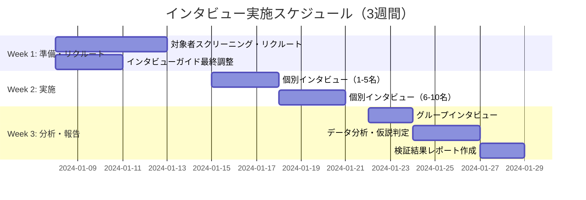

# OffPath 仮説検証インタビュー設計書

## 📋 インタビュー実施概要

### 実施目的
OffPathサービスの8つの核心仮説の検証を通じて、事業成功可能性を客観的に評価し、必要なピボット方向を特定する。

### 対象仮説一覧
| 仮説ID | 仮説名 | 検証優先度 | インタビュー配分 |
|--------|---------|------------|------------------|
| 👤 | 顧客仮説 | 🔥高 | 30% |
| 🧱 | 課題仮説 | 🔥高 | 25% |
| 💎 | 価値仮説 | 🔥高 | 20% |
| 🛠️ | ソリューション仮説 | 🔵中 | 10% |
| 💰 | 収益モデル仮説 | 🔵中 | 8% |
| 🚪 | チャネル仮説 | 🔵中 | 4% |
| 🌱 | スケーラビリティ仮説 | 🟡低 | 2% |
| 🤖 | 技術実現性仮説 | 🔥高 | 1% |

---

## 👥 対象者設定・リクルーティング戦略

### プライマリーターゲット（70%）
**冒険志向の経験豊富な旅行者**
- **年齢**: 25-45歳
- **年収**: 500万円以上
- **海外旅行頻度**: 年3回以上
- **特徴**: 有名観光地に物足りなさを感じている

### セカンダリーターゲット（30%）
**体験重視の若年層**
- **年齢**: 22-30歳
- **SNS疲れ**: 既存の旅行SNSに不満あり
- **価値観**: 「本物の体験」を重視

### サンプルサイズ・構成
```
総インタビュー数: 15名
├── 深度インタビュー: 10名（60分/回）
│   ├── プライマリー: 7名
│   └── セカンダリー: 3名
└── グループインタビュー: 5名（90分/1セッション）
    ├── プライマリー同士: 3名
    └── セカンダリー同士: 2名
```

### リクルーティング手法
1. **SNS経由** (40%)
   - 旅行関連投稿の高エンゲージメントユーザー
   - ハッシュタグ：#バックパッカー #一人旅 #秘境旅行

2. **旅行コミュニティ** (30%)
   - Reddit r/solotravel
   - Facebook旅行グループ
   - 旅行ブロガーネットワーク

3. **知人紹介** (20%)
   - チーム・知人の紹介
   - スノーボール・サンプリング

4. **クラウドソーシング** (10%)
   - ランサーズ・クラウドワークス
   - 条件明示でのリクルート

---

## 🎯 インタビュー実施方針

### 基本方針
- **非誘導的アプローチ**: サービス説明は最小限に留め、現状の課題と理想を自然に引き出す
- **感情的洞察重視**: 数値的な回答より、感情的な反応や行動の背景を深掘り
- **仮説検証軸明確化**: 各質問が検証する仮説を明確にし、回答の解釈基準を統一

### 進行時間配分（60分個別インタビューの場合）

```
│時間│セクション│内容│検証仮説│
├─0-5分─┤アイスブレイク┤緊張緩和・関係性構築┤─┤
├─5-15分─┤現状の旅行体験┤現在の旅行スタイル・課題┤👤🧱┤
├─15-30分─┤課題深掘り┤不満・理想の体験┤🧱💎┤
├─30-45分─┤ソリューション反応┤サービス提示・価値確認┤💎🛠️┤
├─45-55分─┤購買・継続意向┤課金・利用継続の意思┤💰🚪┤
├─55-60分─┤クロージング┤追加情報・次回連絡┤─┤
```

### 実施環境・設備
- **場所**: オンライン（Zoom）＋対面（カフェ・貸会議室）
- **録画・録音**: 全セッション録画（同意取得済み）
- **記録ツール**: Otter.ai + 手動メモ
- **分析ツール**: Notion Database + Miro（マッピング）

---

## 📊 仮説検証の成功・失敗判定基準

### 定量的判定基準

| 仮説 | 成功基準 | 失敗基準 | 追加検証基準 |
|------|----------|----------|-------------|
| 👤 顧客仮説 | ペルソナ一致度70%以上 | ペルソナ一致度40%未満 | 40-70%：セグメント拡張検討 |
| 🧱 課題仮説 | 課題深刻度4.0以上/5.0 | 課題深刻度2.5未満/5.0 | 2.5-4.0：課題再定義 |
| 💎 価値仮説 | 価値実感度4.5以上/5.0 | 価値実感度3.0未満/5.0 | 3.0-4.5：価値提供方法改善 |
| 🛠️ ソリューション仮説 | 解決期待度4.0以上/5.0 | 解決期待度2.5未満/5.0 | 2.5-4.0：機能改善 |
| 💰 収益モデル仮説 | 課金意向3.5以上/5.0 | 課金意向2.0未満/5.0 | 2.0-3.5：価格再設定 |

### 定性的判定指標

**🔍 観察ポイント**
- **感情的反応**: 興奮・共感・疑問の表情変化
- **言語的反応**: 「まさに！」「それって...」などの自然な反応
- **行動的反応**: 前のめりになる、スマホでメモを取るなど
- **質問の質**: 具体的・建設的な質問の有無

**⚠️ 懸念シグナル**
- 課題への共感が薄い反応
- ソリューションへの懐疑的な表情
- 課金に対する強い抵抗感
- 競合サービスとの差別化が伝わらない

---

## 🔄 実施スケジュール・体制

### 3週間実施スケジュール



### 実施体制・役割分担

| 役割 | 担当者 | 責任範囲 | 時間配分 |
|------|--------|----------|----------|
| **リードインタビュアー** | PM | 質問・進行・判断 | 全セッション |
| **アシスタント** | マーケ担当 | 記録・観察・補助質問 | 全セッション |
| **分析責任者** | データアナリスト | データ整理・仮説判定 | 分析フェーズ |
| **レポート作成** | PM + アナリスト | 結果まとめ・提言作成 | 最終週 |

### 品質管理・バイアス対策

**🎯 インタビュアーバイアス対策**
- 質問の順序・表現の標準化
- 誘導質問の排除チェックリスト
- 複数人での観察・記録

**📊 サンプルバイアス対策**  
- 多様なリクルート経路の確保
- ペルソナ外ユーザーの意図的含有（20%）
- 地域・職業・年収の分散確保

**🔍 分析バイアス対策**
- 仮説に反する証拠の積極的収集
- 複数人での独立分析→突合
- 外部メンター・アドバイザーでの検証