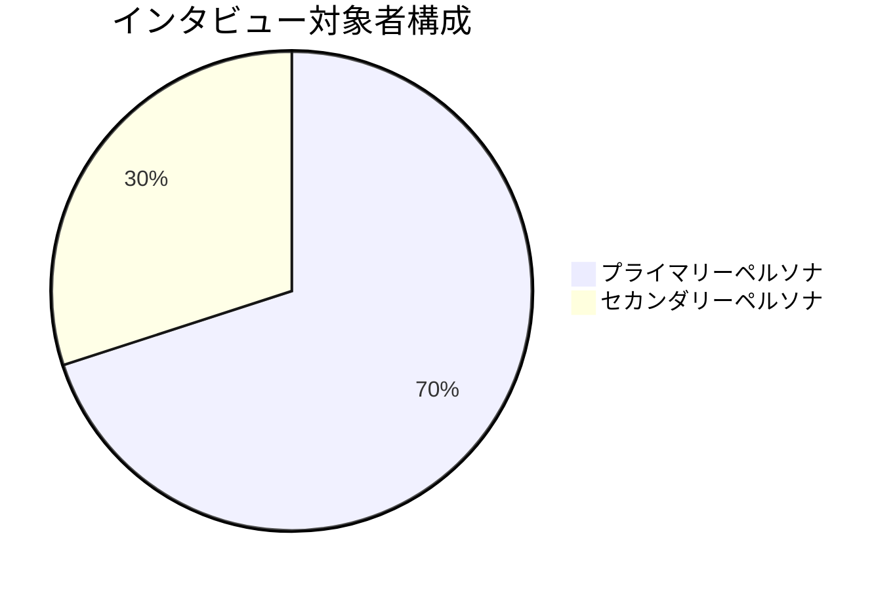
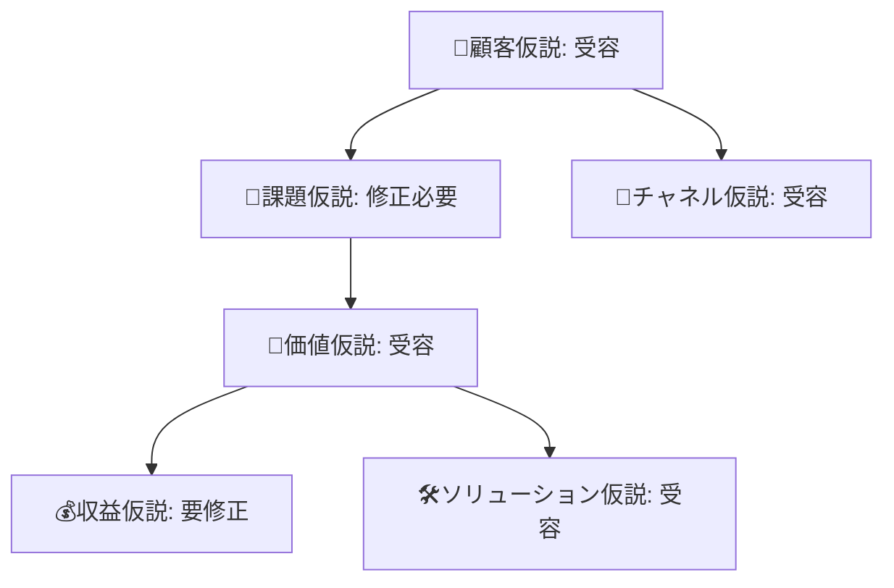

# 仮説検証インタビュー結果レポート

## 📊 エグゼクティブサマリー

### 検証結果概要

| 仮説 | 検証結果 | 信頼度 | 重要度 | 次の行動 |
|------|----------|--------|--------|----------|
| 👤 顧客仮説 | □受容 □棄却 □要修正 | ___/5 | 🔥高 | ____________ |
| 🧱 課題仮説 | □受容 □棄却 □要修正 | ___/5 | 🔥高 | ____________ |
| 💎 価値仮説 | □受容 □棄却 □要修正 | ___/5 | 🔥高 | ____________ |
| 🛠️ ソリューション仮説 | □受容 □棄却 □要修正 | ___/5 | 🔵中 | ____________ |
| 💰 収益モデル仮説 | □受容 □棄却 □要修正 | ___/5 | 🔵中 | ____________ |
| 🚪 チャネル仮説 | □受容 □棄却 □要修正 | ___/5 | 🔵中 | ____________ |
| 🌱 スケーラビリティ仮説 | □受容 □棄却 □要修正 | ___/5 | 🟡低 | ____________ |
| 🤖 技術実現性仮説 | □受容 □棄却 □要修正 | ___/5 | 🔥高 | ____________ |

### 総合判定

**🎯 事業継続性評価**: □継続 □ピボット □中止

**📈 成功確率**: ___%

**⚠️ 主要リスク**: ________________________________

**🚀 推奨アクション**: ________________________________

---

## 📋 調査実施概要

### 実施期間・規模
- **実施期間**: 2024年___月___日 〜 ___月___日
- **総インタビュー数**: ___名
- **有効データ数**: ___名
- **平均実施時間**: ___分

### サンプル構成


| 属性 | プライマリー(___名) | セカンダリー(___名) | 合計 |
|------|---------------------|-------------------|------|
| **男性** | ___名 | ___名 | ___名 |
| **女性** | ___名 | ___名 | ___名 |
| **25-29歳** | ___名 | ___名 | ___名 |
| **30-34歳** | ___名 | ___名 | ___名 |
| **35-39歳** | ___名 | ___名 | ___名 |
| **40-45歳** | ___名 | ___名 | ___名 |

### データ品質評価
- **平均信頼度**: ___/5
- **録画取得率**: ___%
- **完全実施率**: ___%（予定時間の90%以上）

---

## 🎯 仮説別検証結果詳細

### 👤 顧客仮説：冒険志向の旅行者（25-45歳）がターゲット層

#### 📊 定量結果
- **ペルソナ一致度**: ___/5 （目標: 4.0以上）
- **一致率**: ___%（目標: 70%以上）
- **想定外ユーザー比率**: ___%

#### 📝 定性結果
**✅ 受容要因**
```
- 共通特徴: ___________________________
- 価値観の一致: _______________________
- 行動パターン: _______________________
```

**⚠️ 棄却・修正要因**
```
- ペルソナとの乖離: ____________________
- 想定外のニーズ: ______________________
- 見落とした特徴: ______________________
```

#### 🎯 判定・アクション
**最終判定**: □受容 □棄却 □修正（理由: ________________）

**修正内容**:
- **年齢層**: ___歳〜___歳への変更
- **属性追加**: ________________________________
- **セカンダリー重視**: ________________________________

---

### 🧱 課題仮説：観光地化への物足りなさ・真のローカル体験への渇望

#### 📊 定量結果
- **課題深刻度**: ___/5 （目標: 4.0以上）
- **課題共感率**: ___%
- **具体エピソード取得率**: ___%

#### 📝 定性結果
**🔥 強い課題共感群（___名）**
```
代表的な発言:
「_________________________________」
「_________________________________」

共通の体験:
- ___________________________
- ___________________________
```

**😐 中程度課題認識群（___名）**
```
課題は感じるが深刻ではない理由:
- ___________________________
- ___________________________
```

**🤔 課題非認識群（___名）**
```
課題を感じない理由:
- ___________________________
- ___________________________
```

#### 🎯 判定・アクション
**最終判定**: □受容 □棄却 □修正（理由: ________________）

**課題再定義**:
- **真の課題**: ________________________________
- **課題の深さ**: ________________________________
- **解決優先度**: ________________________________

---

### 💎 価値仮説：隠れ名所での予測不可能な体験価値

#### 📊 定量結果
- **価値実感度**: ___/5 （目標: 4.5以上）
- **競合優位性**: ___/5
- **利用意向**: ___%

#### 📝 定性結果
**🌟 高評価要素**
```
最も魅力的と感じた価値:
1. ___________________________
2. ___________________________
3. ___________________________

感情的反応:
「_________________________________」
「_________________________________」
```

**⚠️ 懸念・不安要素**
```
懸念事項:
1. ___________________________
2. ___________________________

リスク認識:
「_________________________________」
「_________________________________」
```

#### 🎯 判定・アクション
**最終判定**: □受容 □棄却 □修正（理由: ________________）

**価値提供改善**:
- **強化すべき価値**: ________________________________
- **軽減すべきリスク**: ________________________________
- **新たな価値発見**: ________________________________

---

### 🛠️ ソリューション仮説：AI解析による隠れ名所発見の有効性

#### 📊 定量結果
- **解決期待度**: ___/5 （目標: 4.0以上）
- **AI機能理解度**: ___/5
- **実用性評価**: ___/5

#### 📝 定性結果
**🤖 AI機能への反応**
```
理解度:
□高い理解 □基本理解 □理解困難

期待感:
□強い期待 □適度な期待 □懐疑的

不安要素:
「_________________________________」
「_________________________________」
```

**⚙️ 機能別評価**
```
隠れ名所発見: ___/5
「_________________________________」

カオス旅程生成: ___/5  
「_________________________________」

現地サポート: ___/5
「_________________________________」
```

#### 🎯 判定・アクション
**最終判定**: □受容 □棄却 □修正（理由: ________________）

**機能改善提案**:
- **優先開発機能**: ________________________________
- **削除検討機能**: ________________________________
- **新規追加機能**: ________________________________

---

### 💰 収益モデル仮説：月額2,980円課金意向

#### 📊 定量結果
- **課金意向度**: ___/5 （目標: 3.5以上）
- **価格妥当性**: ___/5
- **継続利用意向**: ___/5

#### 📝 定性結果
**💳 課金意向分析**
```
積極的課金意向（___名）:
- 想定価格帯: _______円〜_______円
- 支払い条件: _________________

条件付き課金意向（___名）:
- 条件: ______________________
- 価格上限: ___________円

課金困難（___名）:
- 理由: ______________________
- 代替案: ____________________
```

**💰 価格感度分析**
```
平均適正価格: _______円
価格レンジ: _______円〜_______円

比較対象サービス:
- _______________: _______円
- _______________: _______円
```

#### 🎯 判定・アクション
**最終判定**: □受容 □棄却 □修正（理由: ________________）

**価格戦略修正**:
- **推奨価格**: _______円
- **価格体系**: ________________________________
- **無料プランの範囲**: ________________________________

---

### 🚪 チャネル仮説：コンテンツマーケティングの有効性

#### 📊 定量結果
- **コンテンツ関心度**: ___/5 （目標: 4.0以上）
- **リーチチャネル適合**: ___/5
- **口コミ意向**: ___/5

#### 📝 定性結果
**📱 情報収集行動パターン**
```
主要情報源:
1. ___________________________（___名）
2. ___________________________（___名）
3. ___________________________（___名）

信頼する媒体:
1. ___________________________
2. ___________________________

SNS利用状況:
- Instagram: ___名
- YouTube: ___名
- TikTok: ___名
- ブログ: ___名
```

**📢 推奨意向分析**
```
積極的推奨意向: ___名
条件付き推奨: ___名
推奨困難: ___名

推奨方法:
「_________________________________」
```

#### 🎯 判定・アクション
**最終判定**: □受容 □棄却 □修正（理由: ________________）

**チャネル戦略修正**:
- **優先チャネル**: ________________________________
- **コンテンツ内容**: ________________________________
- **メッセージング**: ________________________________

---

## 🔄 統合分析・事業判断

### クロス分析結果

#### 仮説間の相関関係


#### ペルソナ別反応差異
| 項目 | プライマリー | セカンダリー | 差異 |
|------|-------------|-------------|------|
| 課題深刻度 | ___/5 | ___/5 | ___ |
| 価値実感度 | ___/5 | ___/5 | ___ |
| 課金意向 | ___/5 | ___/5 | ___ |
| 推奨意向 | ___/5 | ___/5 | ___ |

### 新たな発見・示唆

#### 🆕 予想外の発見
```
1. _________________________________
   → 事業への影響: ________________

2. _________________________________
   → 事業への影響: ________________

3. _________________________________
   → 事業への影響: ________________
```

#### 💡 改善機会
```
機能改善:
- ________________________________
- ________________________________

価値提供改善:
- ________________________________
- ________________________________

ターゲティング改善:
- ________________________________
- ________________________________
```

---

## 🎯 推奨アクション・意思決定

### 緊急対応事項（2週間以内）

#### 🚨 クリティカル修正
- [ ] **課題仮説の再定義**
  - 修正内容: ________________________________
  - 検証方法: ________________________________

- [ ] **価格戦略の見直し**
  - 新価格: _______円
  - 根拠: ________________________________

- [ ] **ターゲット修正**
  - 変更内容: ________________________________
  - 理由: ________________________________

### 短期実行事項（4週間以内）

#### 🔄 プロダクト改善
- [ ] **機能追加・削除**
  - 追加: ________________________________
  - 削除: ________________________________

- [ ] **UI/UX改善**
  - 改善点: ________________________________

- [ ] **価値提供強化**
  - 強化方法: ________________________________

#### 📢 マーケティング改善
- [ ] **メッセージング修正**
  - 新メッセージ: ________________________________

- [ ] **チャネル戦略調整**
  - 注力チャネル: ________________________________

- [ ] **コンテンツ戦略**
  - 制作内容: ________________________________

### 中長期戦略（3ヶ月以内）

#### 🌱 事業拡張
- [ ] **セカンダリーペルソナ展開**
  - 展開方法: ________________________________

- [ ] **新機能開発**
  - 開発内容: ________________________________

- [ ] **パートナーシップ**
  - 連携候補: ________________________________

---

## ⚠️ リスク評価・対策

### 高リスク要因

#### 🚨 クリティカルリスク
**1. [リスク内容]**
- **発生確率**: ___%
- **事業影響度**: ___/5
- **対策**: ________________________________
- **対策実行期限**: ___月___日

**2. [リスク内容]**
- **発生確率**: ___%
- **事業影響度**: ___/5
- **対策**: ________________________________
- **対策実行期限**: ___月___日

#### ⚠️ 中程度リスク
**1. [リスク内容]**
- **対策**: ________________________________

**2. [リスク内容]**
- **対策**: ________________________________

### リスク軽減策

#### 📊 追加検証の必要性
- [ ] **より大規模な定量調査**（___名以上）
- [ ] **プロトタイプ・MVP検証**
- [ ] **競合分析の深堀り**
- [ ] **技術検証の実施**

---

## 📈 次期検証計画

### Phase 2 検証設計

#### 🎯 検証優先度
1. **最優先**（2週間以内）
   - ________________________________

2. **高優先**（4週間以内）
   - ________________________________

3. **中優先**（3ヶ月以内）
   - ________________________________

#### 📋 検証手法
- [ ] **追加インタビュー**（___名）
- [ ] **オンラインアンケート**（___名）
- [ ] **プロトタイプテスト**
- [ ] **競合ベンチマーク**
- [ ] **専門家ヒアリング**

### 成功・失敗基準の更新

#### 📊 新しい成功基準
| 仮説 | 新基準 | 測定方法 | 期限 |
|------|--------|----------|------|
| 👤 顧客仮説 | | | |
| 🧱 課題仮説 | | | |
| 💎 価値仮説 | | | |
| 🛠️ ソリューション仮説 | | | |
| 💰 収益モデル仮説 | | | |

---

## 📚 付録・データ詳細

### 生データサマリー
- **録画データ**: ___時間___分
- **逐語録**: ___ページ
- **スクリーニング回答**: ___件
- **分析シート**: ___枚

### 主要発言抜粋

#### 👤 顧客仮説関連
```
「_________________________________」
（対象者ID: INT-___, 属性: _____）

「_________________________________」
（対象者ID: INT-___, 属性: _____）
```

#### 🧱 課題仮説関連
```
「_________________________________」
（対象者ID: INT-___, 属性: _____）

「_________________________________」
（対象者ID: INT-___, 属性: _____）
```

### 分析担当者・承認

**分析責任者**: ________________
**分析完了日**: ___年___月___日
**承認者**: ________________
**承認日**: ___年___月___日

---

**このレポートの機密性**: □社内限定 □役員限定 □外部開示可
**次回レビュー予定**: ___年___月___日