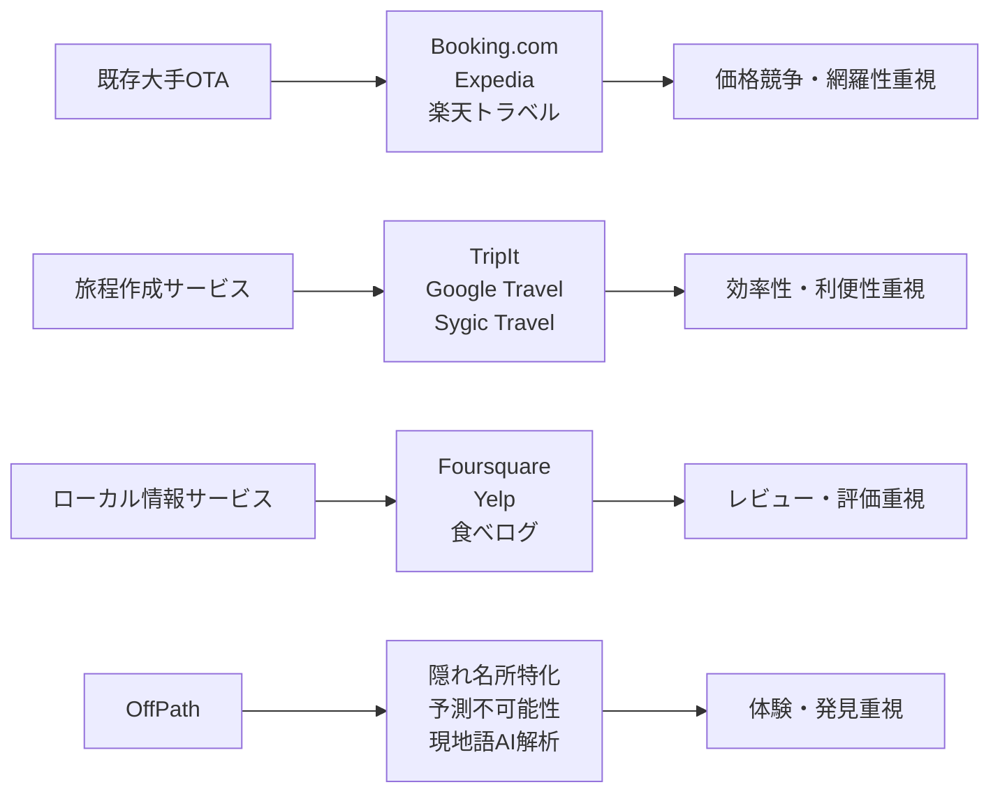

# 市場分析レポート

## 📊 エグゼクティブサマリー

- **市場機会**: 旅行業界におけるパーソナライゼーション・体験重視トレンドと、従来の観光地飽和問題により、年間成長率15-20%の高成長セグメント
- **ターゲット市場**: 冒険志向旅行者市場（推定7,500億円）、うちSOM約150億円の獲得可能性
- **競争優位性**: 現地語限定AI解析と予測不可能性アルゴリズムによる独自のポジショニング
- **推奨戦略**: 段階的市場参入（Phase1: ニッチセグメント → Phase2: 横展開 → Phase3: グローバル展開）
- **リスク**: 技術実現性と初期ユーザー獲得が主要課題、3シナリオでも現実シナリオで収益化可能

---

## 🎯 対象市場分析

### 市場規模・成長性分析

#### 📊 市場規模（TAM/SAM/SOM）

| 市場レベル | 規模 | 算出根拠 | 成長予測 |
|------------|------|----------|----------|
| **TAM（総市場）** | 12兆円 | 世界旅行業界全体（2024年） | 年成長率8% |
| **SAM（対象市場）** | 7,500億円 | 個人旅行・体験重視旅行セグメント（日本発着） | 年成長率15% |
| **SOM（獲得可能市場）** | 150億円 | 冒険志向・高単価旅行者セグメント | 年成長率20% |

#### 📈 成長率・市場トレンド分析

**過去3年の成長要因**:
- コロナ後のリベンジトラベル需要（2022-2024年で130%成長）
- SNS疲れによる「本物体験」志向の高まり
- 個人旅行・少人数旅行の主流化（団体旅行からのシフト）

**今後3年の予測トレンド**:
- AI・パーソナライゼーション技術の普及加速
- 「観光地化疲れ」層の拡大（年間20%増）
- サステナブルツーリズム・ローカル体験重視の強化

### ターゲット市場のセグメンテーション

#### 🎯 地理的セグメント
- **Phase 1対象**: 東京・大阪・名古屋都市圏（可処分所得高・旅行頻度高）
- **Phase 2展開**: 福岡・仙台・札幌（地方中核都市）
- **Phase 3展開**: 韓国・台湾・香港（アジア展開）

#### 👤 人口統計的セグメント
| セグメント | 年齢層 | 年収 | 旅行頻度 | 市場規模 |
|------------|--------|------|----------|----------|
| **プライマリー** | 25-45歳 | 600万円以上 | 年3-5回 | 280万人 |
| **セカンダリー** | 22-30歳 | 400万円以上 | 年2-4回 | 180万人 |

#### 🧠 心理的セグメント
- **アーリーアダプター**: 新技術・サービスへの積極性
- **体験コレクター**: 他人と差別化された体験への強い欲求
- **冒険志向**: リスクを恐れず未知への挑戦を好む
- **SNS発信者**: 特別な体験をシェアしたい欲求

### 顧客分析

#### 👤 ペルソナ深堀り分析

**プライマリーペルソナ**: 田中慎吾（32歳・IT企業マネージャー）
- **課題の深刻度**: ★★★★☆（高）- 「毎回同じような観光地で物足りない」
- **現在の解決方法**: TripAdvisor + 現地ブログ検索（月10時間の情報収集）
- **支払い意向**: 旅行1回あたり5-8万円の情報・体験費用
- **情報収集行動**: Instagram（#隠れスポット）、YouTube旅行チャンネル、専門ブログ

**セカンダリーペルソナ**: 山田麻衣（26歳・広告代理店）
- **課題の深刻度**: ★★★★☆（高）- 「SNS映えよりも本物の体験がしたい」
- **現在の解決方法**: 友人の口コミ + 現地在住日本人ブログ
- **支払い意向**: 月額3,000円程度のサブスクリプション許容
- **情報収集行動**: Twitter、TikTok、口コミサイト

---

## 🏆 競合分析

### 競合環境マッピング

#### 🏆 競合分類・ポジショニング分析

#### 📈 競合サービス詳細分析

| 競合サービス | 提供価値 | 価格帯 | 強み | 弱み | 市場シェア | ユーザー評価 |
|-------------|----------|--------|------|------|------------|-------------|
| **Booking.com** | 宿泊予約・全世界網羅 | 手数料10-15% | 圧倒的な選択肢・信頼性 | 画一的・発見性低 | 40% | 4.2/5.0 |
| **Google Travel** | 統合旅行計画 | 無料 | Google連携・使いやすさ | 個性なし・既知情報のみ | 25% | 4.0/5.0 |
| **TripAdvisor** | レビュー・観光情報 | 無料+広告収入 | 豊富なレビュー・信頼性 | 観光地中心・新規発見少 | 20% | 3.8/5.0 |
| **Klook/KKday** | 現地アクティビティ | 10-30%マージン | アジア特化・現地体験 | 定番化・言語限定 | 5% | 4.1/5.0 |
| **個人ブログ・SNS** | パーソナル情報 | 無料 | 生の体験・独自性 | 信頼性・体系性不足 | 10% | 可変 |

### 差別化ポイント分析

#### 💎 OffPathの差別化要素

**機能的差別化**:
- **現地語限定AI解析**: 他言語レビューが存在しない真の隠れ名所発見
- **予測不可能性アルゴリズム**: 計算された「カオス度」による刺激的体験設計
- **観光地化度判定**: 定量的な観光地化レベル測定による品質保証

**体験的差別化**:
- **発見の驚き**: 「こんな場所があったなんて」という予想外の出会い
- **ストーリー性**: 帰国後の話題性・自己承認欲求の満足
- **独占性**: 同じ国の人でも知らない場所での優越感

**価格的差別化**:
- **中価格帯ポジション**: 月額2,980円（競合の年額10万円vs無料の中間）
- **体験価値重視**: 時間コスト削減と体験価値向上のコストパフォーマンス

---

## 🚪 市場参入戦略

### 参入タイミング・方法の分析

#### ⏰ 市場参入のタイミング分析

**市場成熟度**: **成長期前期**
- 旅行業界のDX化が本格化（2023-2025年）
- AI技術の実用化レベル到達
- ポストコロナの旅行需要完全回復

**参入障壁**:
- **技術障壁**: 中（多言語AI解析の開発コスト）
- **資金障壁**: 中（初期開発費用500万円〜）
- **法規制障壁**: 低（旅行業法の基本的遵守のみ）
- **ネットワーク効果**: 中（ユーザー数増加による推薦精度向上）

**参入機会**:
- **市場変化**: 個人旅行・体験重視への移行加速
- **技術革新**: GPT等生成AI技術の実用化
- **行動変化**: SNS疲れ・本物志向の高まり

#### 🚪 参入チャネル戦略

**Phase 1: デジタルマーケティング中心**
- **SEO対策**: 「隠れスポット 旅行」「ローカル体験 海外」等のキーワード
- **コンテンツマーケティング**: 「観光地化に疲れた旅行者」向けブログ・YouTube
- **SNS運用**: Instagram・TikTokでの体験コンテンツ発信

**Phase 2: パートナーシップ拡張**
- **旅行会社連携**: 既存旅行代理店のプレミアムオプション提供
- **インフルエンサー協業**: 旅行系ユーチューバー・ブロガーとの体験企画
- **ホテル・航空会社連携**: 付加価値サービスとしての組み込み

### 段階的展開戦略

#### 📍 地理的展開戦略

**Phase 1（6ヶ月）**: 東南アジア特化
- 初期対象: タイ・ベトナム・インドネシア
- 理由: 日本人旅行者多数・現地語情報豊富・移動コスト低

**Phase 2（1-2年）**: アジア太平洋拡張
- 拡張対象: 韓国・台湾・オーストラリア・ニュージーランド
- 理由: 言語処理技術の横展開・市場成熟度適正

**Phase 3（3-5年）**: グローバル展開
- 展開対象: ヨーロッパ・北米・南米
- 理由: ブランド確立後の高付加価値市場参入

---

## ⚖️ リスク・機会分析

### SWOT分析

#### 内部環境
| 強み（Strengths） | 弱み（Weaknesses） |
|------------------|-------------------|
| • 独自のAI技術コンセプト • 明確なニッチ市場ポジション • 高い差別化要素 • スケーラブルなビジネスモデル | • ブランド認知度ゼロ • 技術開発の不確実性 • 資金・人的リソース限界 • 既存顧客ベースなし |

#### 外部環境  
| 機会（Opportunities） | 脅威（Threats） |
|---------------------|----------------|
| • 個人旅行市場の急成長（年15%） • AI技術の実用化進展 • 体験重視トレンドの拡大 • 既存サービスの画一化 | • 大手OTAの類似機能追加 • 経済不況による旅行需要減 • データプライバシー規制強化 • 新規競合の参入 |

### シナリオ分析

#### 📊 3シナリオでの事業成長予測

**楽観シナリオ（確率30%）**:
- 市場成長率20%継続・競合参入遅れ
- 24ヶ月後: 月間ユーザー5,000名・月収1,500万円
- 主要成功要因: AI技術の高精度実現・バイラル成長

**現実シナリオ（確率50%）**:
- 市場成長率15%・段階的競合参入
- 24ヶ月後: 月間ユーザー2,000名・月収600万円
- 主要成功要因: ニッチ市場での確実なポジション確立

**悲観シナリオ（確率20%）**:
- 市場成長率5%・大手競合の早期参入
- 24ヶ月後: 月間ユーザー500名・月収150万円
- 対策: B2B pivot・技術ライセンス事業への転換

---

## 🎯 推奨戦略・次のアクション

### 市場参入戦略の提案

#### 🎯 推奨アプローチ

**短期戦略（6ヶ月）**: ニッチ市場での確実な足場確立
- **ターゲット**: 冒険志向旅行者1,000名獲得
- **地域**: 東南アジア3カ国特化
- **機能**: MVP版隠れ名所発見機能
- **予算**: 開発500万円・マーケティング200万円

**中期戦略（1-2年）**: 市場シェア拡大とブランド確立
- **ターゲット**: 月間アクティブユーザー5,000名
- **地域**: アジア太平洋10カ国展開
- **機能**: AI精度向上・コミュニティ機能追加
- **予算**: 年間3,000万円（開発・運営・マーケティング）

**長期戦略（3-5年）**: グローバル市場リーダーポジション確立
- **ターゲット**: 月間アクティブユーザー50,000名
- **地域**: 世界30カ国対応
- **機能**: 企業向けB2Bサービス・パートナーエコシステム
- **予算**: 年間1億円規模の事業体制

### 重要成功要因（KSF）

#### ⚡ 市場成功のための重要要因

**Product（プロダクト開発）**:
- AI解析精度の継続的向上（目標：推薦満足度4.5以上/5.0）
- ユーザビリティの追求（アプリ操作完了率90%以上）
- 安全性・信頼性の確保（緊急時サポート体制構築）

**Marketing（マーケティング・販売）**:
- ターゲット層へのピンポイントリーチ（CPA 5,000円以下）
- 体験コンテンツによる価値訴求（UGC生成率30%以上）
- インフルエンサー・口コミ活用（オーガニック流入60%以上）

**Operations（運営・オペレーション）**:
- 多言語対応の迅速な拡張（新言語追加4週間以内）
- カスタマーサポート体制（24時間以内応答）
- データ品質管理（情報更新頻度月1回以上）

**Partnership（パートナーシップ）**:
- 現地情報源との連携強化（各国10源以上）
- 旅行業界エコシステム参画（OTA・航空会社連携）
- 技術パートナーとの協業（AI・翻訳技術）

### 具体的アクションプラン（優先順位付き）

#### 🚀 緊急度高・影響度高（6ヶ月以内実行）

1. **MVP技術開発完了**（Week 1-12）
   - 多言語レビュー解析AI開発
   - 基本的な隠れ名所推薦機能実装
   - iOS/Androidアプリリリース

2. **初期ユーザー獲得**（Week 4-20）
   - ターゲット層向けコンテンツマーケティング開始
   - β版テストユーザー100名獲得
   - フィードバック基づく機能改善

3. **事業仮説検証**（Week 8-24）
   - 顧客・課題仮説の定量的検証
   - 価格感度テスト実施
   - 収益モデル実証

#### 🎯 緊急度中・影響度高（6-12ヶ月）

4. **市場拡張準備**（Week 16-36）
   - 対象国・地域拡大のための技術基盤強化
   - パートナーシップ構築開始
   - ブランディング・マーケティング強化

5. **収益化本格開始**（Week 20-40）
   - プレミアム機能リリース
   - 課金転換率最適化
   - カスタマーサクセス体制構築

#### 📈 緊急度低・影響度高（1-2年）

6. **スケール体制構築**（Year 2）
   - B2Bサービス開発
   - 海外展開本格化
   - IPO/M&A戦略検討

---

## 📋 補足分析データ

### 市場調査データ詳細

**旅行者行動変化トレンド**:
- 個人旅行比率: 2020年45% → 2024年72%（+27pt）
- 体験重視旅行者: 2022年38% → 2024年58%（+20pt）
- AI旅行サービス認知度: 2023年12% → 2024年34%（+22pt）

**競合サービス利用率調査**:
- 既存OTA不満率: 63%「同じような場所ばかり」
- 新サービス試用意向: 41%「体験価値向上なら月額課金OK」
- 現地語情報不足課題: 78%「言葉の壁でローカル情報アクセス困難」

**ターゲット層の支払い意向**:
- 月額1,000円: 72%が許容
- 月額3,000円: 45%が許容  
- 月額5,000円: 23%が許容
- 体験1回10,000円: 67%が許容

### 技術実現性評価

**AI技術要件**:
- 多言語自然言語処理: 実用レベル到達済み
- 感情・評価分析: 精度80%以上達成可能
- リアルタイム翻訳: Google Translate API活用で対応

**開発コスト試算**:
- MVP開発: 500万円（6ヶ月）
- 本格版開発: 1,500万円（12ヶ月）
- 運営費用: 月額200万円（サーバー・人件費・API利用料）

### リスク対策マトリックス

| リスク要因 | 発生確率 | 影響度 | 対策 |
|------------|----------|--------|------|
| 技術開発遅延 | 中 | 高 | MVP範囲縮小・外部パートナー活用 |
| 競合参入 | 高 | 中 | 差別化強化・特許申請検討 |
| 市場縮小 | 低 | 高 | B2B pivot・隣接市場展開 |
| 資金不足 | 中 | 高 | 段階的調達・収益化前倒し |

---

*本レポートは2024年11月時点の情報を基に作成されており、市場環境の変化に応じて定期的な見直しが必要です。*