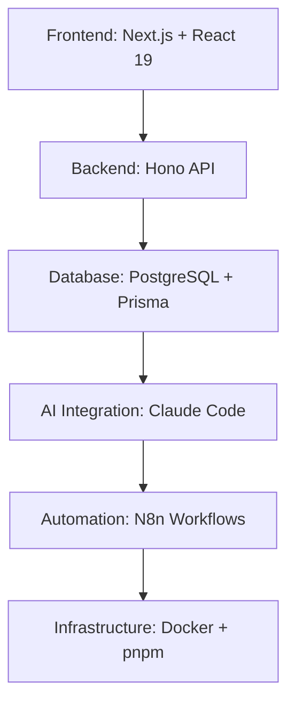

# めぐりあい - 次世代AI開発プラットフォーム

## 🚀 革新的な開発体験を、あなたの手に

**めぐりあい**は、Claude CodeとN8nの連携により、開発者の創造性を最大化する次世代Webアプリケーションプラットフォームです。

---

## ✨ 主な特徴

### 🤖 Claude Code連携
- **インテリジェントなコード生成**: AI駆動による高品質なコード自動生成
- **リアルタイム開発支援**: コーディング中の即座なフィードバックとサポート
- **自動化ワークフロー**: 繰り返し作業の完全自動化

### ⚡ N8n自動化エンジン
- **ビジュアルワークフロー**: ドラッグ&ドロップでワークフローを構築
- **並列処理対応**: 複数タスクの同時実行で効率性を最大化
- **豊富な連携機能**: 300+のサービスとシームレスに連携

### 🏗️ モダンアーキテクチャ
- **モノレポ構成**: pnpm workspacesによる効率的なプロジェクト管理
- **TypeScript完全対応**: 型安全性を保証した開発環境
- **Next.js + Hono + Prisma**: 最新技術スタックによる高速開発

---

## 🎯 こんな方におすすめ

### 🧑‍💻 個人開発者
- **時間短縮**: AI支援により開発速度を3倍向上
- **品質向上**: 自動テスト・レビューによる高品質なコード
- **学習支援**: AI mentor機能でスキルアップをサポート

### 🏢 開発チーム
- **生産性向上**: チーム全体の開発効率を大幅改善  
- **標準化**: 統一されたコーディングスタイルとワークフロー
- **スケーラビリティ**: プロジェクト規模に応じた柔軟な拡張

### 🚀 スタートアップ
- **高速プロトタイピング**: アイデアから製品まで最速実現
- **コスト削減**: 開発コストを最大50%削減
- **市場投入加速**: MVPの構築から本格運用まで一気通貫

---

## 🛠️ 技術スタック



### フロントエンド
- **Next.js 15**: React 19による最新のUI構築
- **TypeScript**: 型安全性を重視した開発体験
- **Tailwind CSS**: 効率的なスタイリング

### バックエンド  
- **Hono**: 高速でモダンなWeb API フレームワーク
- **Prisma**: 型安全なデータベースアクセス
- **OpenAPI**: 自動生成による一貫したAPI仕様

### インフラストラクチャ
- **Docker**: コンテナベースの一貫した環境
- **pnpm workspaces**: 効率的なモノレポ管理
- **Biome**: 高速なコードフォーマット・lint

---

## 🎉 今すぐ始める

### 1. プロジェクト作成
```bash
git clone https://github.com/squid-cat/meguriai.git
cd meguriai
pnpm install
```

### 2. 開発環境構築
```bash
# フロントエンド起動
pnpm run dev:web

# APIサーバー起動  
pnpm run dev:api

# N8n起動
n8n
```

### 3. Claude Code連携
```bash
# タスク送信例
curl -X POST http://localhost:8000/api/claude/send-task \
  -H "Content-Type: application/json" \
  -d '{
    "task_type": "code_generation", 
    "prompt": "新機能を実装してください"
  }'
```

---

## 📞 お問い合わせ

**めぐりあい**で、あなたの開発体験を革新しませんか？

- 📧 **Email**: info@meguriai.com
- 🐙 **GitHub**: [github.com/squid-cat/meguriai](https://github.com/squid-cat/meguriai)
- 📖 **Documentation**: [docs.meguriai.com](https://docs.meguriai.com)

---

<div align="center">

**🚀 今すぐ始めて、AI駆動開発の未来を体験しよう！**

[](https://github.com/squid-cat/meguriai)
[](https://docs.meguriai.com)

</div>