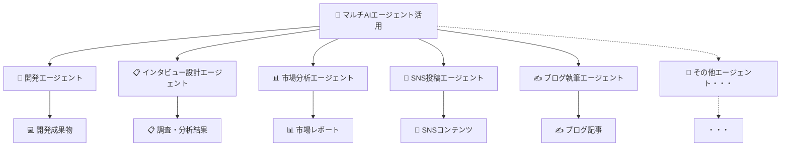
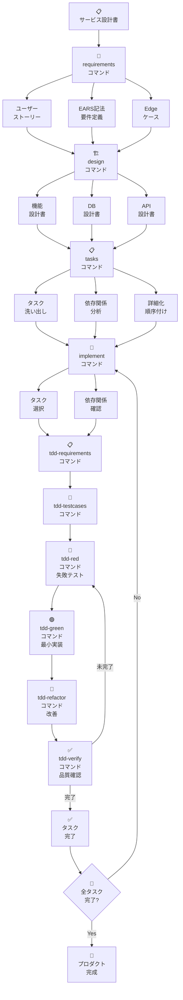

# めぐりあいチームの瞬作プロダクト開発

---

### 🔬 1. 仮説検証サイクルの早期構築

* 瞬作プロダクトの作成だけでなく、他の仮説検証手段も瞬作し、**事業仮説検証サイクルの即時構築をサポート**
* 瞬作プロダクトが有ることを最大限活用するため、瞬作成果物を活用し**初期ユーザー(N=1ユーザー)の獲得にも集中**

#### 🚀 瞬作成果物

| 仮説                             | 瞬作物                                   | 配置場所                                                              |
| -------------------------------- | ---------------------------------------- | --------------------------------------------------------------------- |
| 👤**顧客仮説**             | ・インタビュー設計、インタビューシート等 | インタビュー設計セクション参照                                        |
| 🧱**課題仮説**             | ・課題によりそったweb記事                | topバーのBlogに配置済み                                               |
| 🚪**チャネル仮説**         | ・SNSや広告用バナー生成                  | サイドバーの仮説検証セクション参照                                    |
| 💎**価値仮説**             | ・LP<br />・動くプロダクト               | https://meguriai-web.up.railway.app/                                  |
| 🛠️**ソリューション仮説** | ・動くプロダクト                         | https://meguriai-web.up.railway.app/dashboard                         |
| 🌱**スケーラビリティ仮説** | ・市場規模分析レポート                   | サイドバーの仮説検証セクション参照                                    |
| 💰 収益モデル仮説                | ・動くプロダクト内の課金導線             | https://meguriai-web.up.railway.app/create-trip<br />に課金導線を設置 |

### 🤖 2. マルチAIエージェント活用

🎵 **複数のAIエージェントを活用した協調高速開発**

#### 🔄 マルチAIエージェント活用体系



#### 💡 開発エージェントが走りやすい設計

* 機能設計書として、FE/BEの担当領域を明文化
* OpenAPI駆動非同期開発

```
📝 OpenAPI駆動非同期開発
         ↓
    🔀 開発分岐点(機能設計書参考)
    ↙         ↘
💻 BE開発AI    🖥️ FE開発AI
    ↘         ↙
   🔗 API統合
         ↓
   ⚡ プロダクトに反映
```

---

### 🏗️ 3. DocDDによる持続/拡張可能な瞬作設計

📚 常時最新化される**仕様書や設計書を起点とした開発で、今後の人の手による開発/保守も想定**

#### 🎯 DocDDの効果と価値

| 🎯 DocDD効果             | 🛠️ 具体的手法              | 📈 開発価値                                                                                |
| ------------------------ | ---------------------------- | ------------------------------------------------------------------------------------------ |
| 🔧**保守性確保**   | 仕様書→コード生成           | 仕様が明文化され、常に最新化される。後続開発者が理解可能                                   |
| 💸**技術負債回避** | 設計方針の明確化             | 設計意図(APIの形式/エラーハンドリング等)が永続化                                           |
| 📈**スケール対応** | 必要と思われる機能の事前設計 | 認証認可・ファイルアップロード・リアルタイム通信などをあらかじめどのように実装するか設計済 |
| 🎯**品質担保**     | テストによる機能担保         | TDDの仕組みをスピーディーに取り込む準備済                                                  |

#### 📋 ベースとなる仕様書/設計書

```
📂 packages/documents/docs/
├── 📄 business_plan.md      (事業計画書)
├── 📄 service-design.md     (サービス設計書)
├── 📄 requirements.md       (要件定義書)
└── 📂 designs/
    ├── 🔧 api-design.md     (API設計書)
    ├── 🏛️ architecture.md   (アーキテクチャ設計書)
    ├── 🔄 dataflow.md       (データフロー設計書)
    ├── 🗄️ db-design.md      (DB設計書)
    └── ⚙️ feature-design.md (機能設計書)
```

#### 開発ライフサイクル

今回準備したClaude codeのSlash commandsを活用して行う開発ライフサイクル
