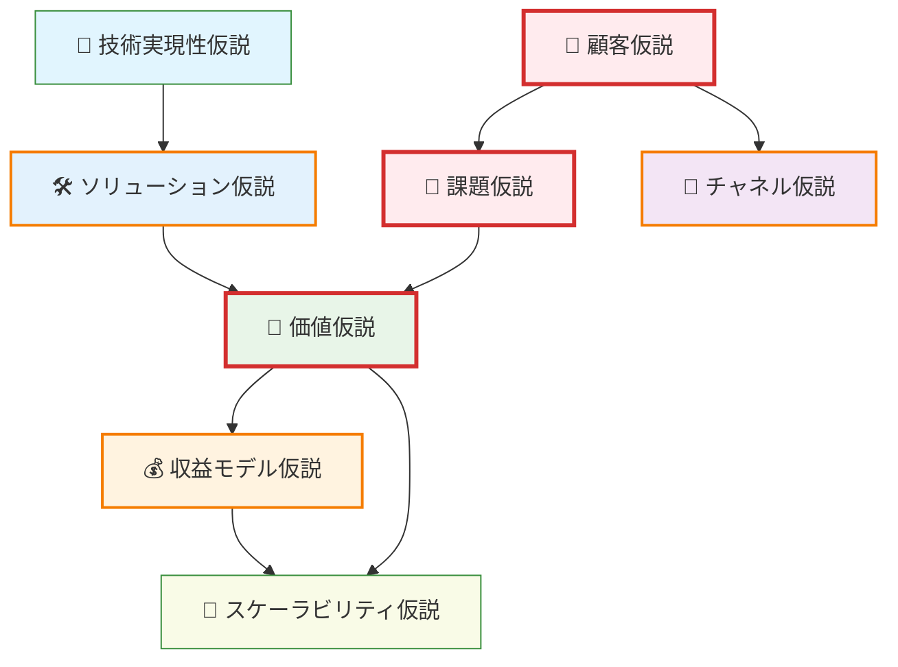

# プロダクト起点ビジネスプラン生成プロンプト v2.0

## 概要

生成AI時代における「プロダクト起点の事業計画」作成を支援するプロンプトです。
**既にリリースされた動くプロダクトを活用した戦略的な仮説検証**に焦点を当てています。

### 前提条件
- **既存プロダクト**: 動くプロダクトのコードが同リポジトリに存在し、既にリリースされている
- **検証機能**: 初期プロダクトには仮説検証のための分析機能は含まれていない
- **データ取得**: ユーザー行動や成果を測定するための機能追加が必要

### アプローチ
サービス設計書と既存プロダクトの状況を基に、**コンテンツマーケティングによる仮説検証型ユーザー獲得**を中心とした効率的な検証計画を策定します。課題共感コンテンツでのユーザー獲得と仮説検証を同時実行することで、リソースを最大活用します。

---

## STEP1: 仮説の抽出と整理

### 1-1. 入力情報の分析

提供されたサービス設計書と実装状況を分析し、以下の仮説体系に当てはめて整理してください。

#### 📊 実装状況による仮説の分類
- **🟢 検証済み仮説**: 実装済み機能に基づき、既存データで検証可能
- **🟡 一部検証済み仮説**: 一部実装済みだが、追加検証が必要
- **🔴 未検証仮説**: 未実装機能に関わる、これから検証が必要な仮説

#### 🔗 仮説の関係性マッピング

仮説間の依存関係をMermaidフローチャートで可視化してください：



#### 📋 仮説一覧

| 仮説カテゴリ | 記載内容 | 検証優先度 | リスクレベル | 実装状況例 |
|------------|----------|------------|-------------|-------------|
| 👤 **顧客仮説** | このプロダクト・サービスの対象となる顧客層は誰か？ | 🔥高 | ⚠️高 | 🟡 ユーザー登録データから一部検証 |
| 🧱 **課題仮説** | 想定した顧客が抱えている課題は何か？その課題はどれほど深刻か？ | 🔥高 | ⚠️高 | 🔴 設計書のみ、検証未実施 |
| 💎 **価値仮説** | 顧客が感じている課題を、自社の提供価値によってどう解決できるか？ | 🔥高 | ⚠️中 | 🟡 コア機能リリース済み、効果測定中 |
| 🛠️ **ソリューション仮説** | 具体的にどんな機能・サービスを提供すれば価値が実現できるのか？ | 🔵中 | ⚠️中 | 🟢 MVP機能実装完了、ログ取得中 |
| 💰 **収益モデル仮説** | 顧客はこのソリューションに対して、どの程度の金額を支払う意思があるのか？ | 🔵中 | ⚠️高 | 🔴 課金機能未実装 |
| 🚪 **チャネル仮説** | 顧客にどのような手段でリーチし、サービスを届けることができるか？ | 🔵中 | ⚠️中 | 🟡 SNS流入のみ、他チャネル未検証 |
| 🌱 **スケーラビリティ仮説** | このビジネスは将来的に他セグメントや市場へスケールできるか？ | 🟡低 | ⚠️低 | 🔴 現セグメント注力中 |
| 🤖 **技術実現性仮説** | 想定するソリューションは現在の技術・リソースで実現可能か？ | 🔥高 | ⚠️中 | 🟢 MVP技術検証完了 |

### 1-2. コア仮説の特定

上記の関係性マッピングから、**コア仮説**（他の仮説の前提となるもの）を特定し、検証の起点を明確にしてください。

---

## STEP2: 仮説検証戦略の設計

### 2-1. 段階的検証戦略の設計

既存プロダクトを活用して、以下の3段階で検証戦略を設計してください：

#### Phase 1: 基盤構築・仮説検証型ユーザー獲得（Week 1-3）
- **API実装完了・検証基盤構築**
- **課題共感コンテンツ制作・SNS展開**（動画・記事による課題仮説検証）
- **コンテンツ反応分析からのインタビュー対象者特定**
- **コンテンツ経由での初期ユーザー獲得**（ユーザー獲得と顧客仮説検証の同時実行）

#### Phase 2: コンテンツ拡張・価値仮説検証（Week 4-7）
- **課題別記事コンテンツ量産**（SEO・SNS拡散による継続的ユーザー獲得）
- **コンテンツエンゲージメント分析**（顧客セグメント・課題深度の検証）
- **コンテンツ経由ユーザー拡大**と**プロダクト価値検証の並行実行**
- **旅行体験者の追跡調査**（価値仮説の実証）

#### Phase 3: 事業化・スケール検証（Week 8-12）
- **🔴 未検証仮説**に対する新機能開発・検証
- **コンテンツ品質と課金意向の相関分析**
- **コンテンツマーケティングのスケール戦略検証**

### 2-2. データ取得・分析計画

各仮説の検証において、以下を具体的に定義してください：

#### 📊 メトリクス設計（コンテンツマーケティング統合）
| 仮説 | 主要メトリクス | 測定方法 | 成功基準 | 棄却基準 |
|------|----------------|----------|----------|----------|
| 👤 顧客仮説 | ターゲット層比率、コンテンツ反応率、流入経路別属性 | 登録フォーム、SNS分析、GA4 | 想定ペルソナ50%以上、高反応層一致80%以上 | 想定外ユーザー70%以上 |
| 🧱 課題仮説 | 課題別コンテンツエンゲージメント、不安度スコア | SNS反応分析、インタビュー、アンケート | エンゲージメント率15%以上、共感度4.0以上/5.0 | エンゲージメント率5%未満、共感度2.5未満/5.0 |
| 💎 価値仮説 | コンテンツ→登録転換率、安心度向上、NPS | GA4、アプリ内測定、行動ログ | 転換率5%以上、安心度向上+2.0、NPS > 30 | 転換率1%未満、安心度変化なし、NPS < 0 |
| 🚪 チャネル仮説 | コンテンツ別流入効率、SNSプラットフォーム別CVR | SNS分析、GA4、流入経路分析 | コンテンツ経由70%以上、記事CVR 3%以上 | コンテンツ経由30%未満、記事CVR 1%未満 |
| ... | ... | ... | ... | ... |

### 2-3. 段階別検証実行計画

#### 📊 Phase 1: 基盤構築・仮説検証型ユーザー獲得（Week 1-3）
| アクション | 対象仮説 | 必要リソース | 成功の判断基準 | 実装要件 |
|----------|----------|-------------|----------------|----------|
| API実装完了・DB接続 | 🤖技術実現性仮説 | エンジニア2名 | 全機能のDB永続化完了 | 🔴 開発環境・本番DB構築 |
| 課題共感動画制作・SNS展開 | 👤顧客仮説、🧱課題仮説 | マーケ1名、デザイナー0.5名 | 動画3本投稿、合計1000いいね以上 | 🔴 動画制作・SNS広告予算 |
| 課題別記事コンテンツ制作 | 🧱課題仮説、🚪チャネル仮説 | マーケ1名、PM0.5名 | 課題別記事5本公開、SEO上位狙い | 🔴 ライティング・SEO対策 |
| SNS反応からインタビュー対象者特定 | 👤顧客仮説、🧱課題仮説 | PM1名、マーケ0.5名 | 高反応ユーザー20名特定・インタビュー実施 | 🔴 SNS分析・インタビュー実施 |
| コンテンツ経由初期ユーザー獲得 | 👤顧客仮説、🚪チャネル仮説 | マーケ1名、PM0.5名 | ターゲット層30名登録・課題共感確認 | 🔴 コンテンツ・導線最適化 |

#### 🔍 Phase 2: コンテンツ拡張・価値仮説検証（Week 4-7）
| アクション | 対象仮説 | 必要リソース | 成功の判断基準 | 実装要件 |
|----------|----------|-------------|----------------|----------|
| 課題別記事コンテンツ量産 | 🧱課題仮説、🚪チャネル仮説 | マーケ1名、ライター1名 | 週3記事公開、月間PV 10,000以上 | 🔴 ライティング・SEO・SNS予算 |
| コンテンツエンゲージメント分析 | 👤顧客仮説、🧱課題仮説 | マーケ1名、アナリスト1名 | セグメント別反応率・流入経路分析 | 🔴 SNS分析・GA4設定 |
| コンテンツ経由ユーザー拡大 | 🚪チャネル仮説、💎価値仮説 | マーケ1名、PM0.5名 | 記事・動画経由100名登録、属性検証 | 🟢 Phase1コンテンツ基盤活用 |
| プロダクト価値検証・効果測定 | 💎価値仮説、🛠️ソリューション仮説 | アナリスト1名、PM1名 | 旅行前後不安度2.0以上減少、NPS > 30 | 🟡 継続追跡・測定機能追加 |

#### 🚀 Phase 3: 事業化・スケール検証（Week 8-12）
| アクション | 対象仮説 | 必要リソース | 成功の判断基準 | 実装要件 |
|----------|----------|-------------|----------------|----------|
| コンテンツ品質×課金意向相関分析 | 💰収益モデル仮説 | アナリスト1名、PM0.5名 | エンゲージメント高者の課金転換率8%以上 | 🟢 既存データ分析 |
| 課金機能実装・価格感度テスト | 💰収益モデル仮説 | エンジニア1名、PM0.5名 | 課金転換率5%以上、ARPU測定 | 🔴 決済・課金機能開発 |
| コンテンツマーケティングスケール検証 | 🚪チャネル仮説、🌱スケーラビリティ仮説 | マーケ1名 | 複数チャネルでCVR比較、他セグメント検証 | 🔴 マルチチャネル・セグメント展開 |

---

## STEP3: リスク管理と軌道修正計画

### 3-1. 仮説棄却時の対応策

各重要仮説が棄却された場合の**ピボット戦略**を事前に定義：

- **顧客仮説棄却** → ターゲット変更 or 課題の再定義
- **価値仮説棄却** → ソリューションアプローチの変更
- **収益モデル仮説棄却** → マネタイズ方法の再検討

### 3-2. 学習サイクルの設計

**Weekly Review Meeting**の設計：
1. 新規学習内容の共有
2. 仮説の状態更新（検証中/受容/棄却/保留）
3. 次週の検証計画調整
4. リソース配分の見直し

---

## STEP4: チーム協働フレームワーク

### 4-1. 仮説管理ツール

**推奨ツール構成**：
- **仮説トラッキング**: Notion, Airtable
- **ユーザー行動分析**: Google Analytics 4, Mixpanel
- **コンテンツマーケティング**: SNS分析ツール, Canva, ライティングツール
- **ユーザーインタビュー**: Zoom, Loom
- **A/Bテスト**: Optimizely, Firebase
- **SEO・コンテンツ分析**: Google Search Console, SNS Insights

### 4-2. コミュニケーションルール

- 全ての施策に「検証対象仮説」を明記
- 仮説の状態変更時は即座にチーム共有
- データに基づかない意思決定の禁止

---

## STEP5: 最終出力

STEP1-4の分析・設計結果を統合し、以下の構造で実行可能な事業計画書を出力してください：

### 📋 出力構造
```markdown
# {サービス名} 事業仮説検証計画

## 📊 事業概要・現状分析
- サービス概要・提供価値
- 既存プロダクトの状況
- 市場機会・課題認識

## 🎯 検証対象仮説
- 仮説関係性図（Mermaidフローチャート）
- 検証対象仮説一覧（優先度・リスク・実装状況付き）
- コア仮説の特定

## 📈 検証戦略・スケジュール  
- 3段階検証アプローチ（Phase 1-3の概要）
- 検証スケジュール（Mermaidガントチャート）
- 段階別実行計画（詳細アクション・リソース・基準）

## 📊 測定・分析体制
- メトリクス定義・測定方法
- 成功・棄却基準
- データ収集・分析体制

## ⚠️ リスク管理・意思決定
- 仮説棄却時の対応策
- 意思決定フロー（Mermaidフローチャート）  
- ピボット判断基準

## 🤝 運用体制・ツール
- チーム体制・役割分担
- 仮説管理ツール・ワークフロー
- レビューサイクル・コミュニケーションルール
```

### 🎯 出力要件
- **ファイル名**: `business_plan.md`
- **出力先ディレクトリ**: `/packages/documents/docs/`
- **視点**: 実行チームが即座に実行できる事業計画書
- **構成**: 作成プロセスは含めず、実行内容のみ記載
- **Mermaid図表**: 仮説関係性図、検証スケジュール、意思決定フローを含む

---

## 入力情報

以下の情報を提供してください：

### 必須情報1: サービス設計書
```
[サービス設計書の内容を入力]
※ InnerCircle.mdのような、サービス概要・想定ユーザー・ユースケースを含む設計書
packages/documents/docs/service_design.mdを自動参照
```

### 必須情報2: 既存プロダクトの状況
```
【基本情報】
🚀 プロダクト名: 
📅 リリース日: 
🌐 リリース環境: (Web/iOS/Android等)
👥 現在のユーザー数: 
📊 月間アクティブユーザー数: 

【実装状況】
✅ 実装済み機能: 
❌ 未実装機能: 
🛠️ 技術スタック: 
🔍 現在の分析・測定機能: (GA、ログ機能等)

【現在の課題・データ】
📈 利用可能な定量データ: 
💬 ユーザーからのフィードバック: 
⚠️ 設計書との主な乖離: 
🚨 緊急で解決したい課題: 
🎯 最も検証したい仮説: 

【チーム・リソース状況】
👨‍💻 開発チーム構成: 
⏰ 検証に割ける期間: 
💰 追加開発の予算制約: 
```

---

## 📋 品質チェックリスト

最終的な事業計画書として以下を確認してください：

### 📊 事業計画書としての完成度
- [ ] 実行チームが即座に実行できる具体的な計画になっている
- [ ] 作成プロセス（STEP1-5等）ではなく、実行内容のみが記載されている
- [ ] 初見のメンバーが理解しやすい自然な構成になっている

### 🎯 内容の妥当性
- [ ] 既存プロダクトの状況・制約が現実的に反映されている
- [ ] 仮説が実装状況に応じて適切に分類・優先順位付けされている（🟢🟡🔴）
- [ ] 12週間での段階的検証アプローチが論理的に構成されている
- [ ] コンテンツマーケティングによる仮説検証型ユーザー獲得が設計されている
- [ ] ユーザー獲得と仮説検証の統合的アプローチが効率的に構成されている
- [ ] 検証スケジュールが2025年8月5日始まりとなっている。

### 📈 実行可能性
- [ ] 検証可能で具体的なメトリクス・成功基準が定義されている
- [ ] 必要リソース・チーム体制が現実的に設定されている
- [ ] 失敗時の対応策・ピボット基準が明確に示されている
- [ ] 日常運用での仮説管理・意思決定方法が具体的に記載されている

### 🎨 可視化・図表
- [ ] Mermaid図表（仮説関係性、スケジュール、意思決定フロー）にシンタックスエラーがない
- [ ] 図表が事業計画の理解を助けるものになっている
